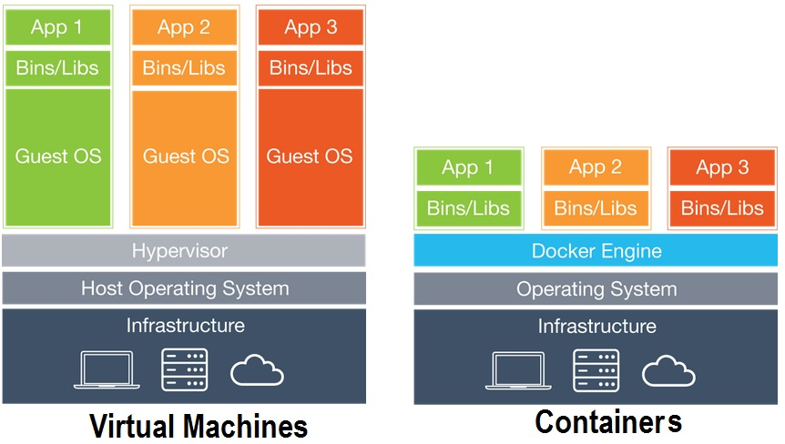

# Part 1: Container Theory

## What are Containers?

Containers are an open-source project that allows developers to easily automate the deployment of their software applications by providing an additional layer of abstraction and automation of OS-level virtualization, one such example of containers is Docker.

The key benefits of Docker containers is that it allows users to package an application with all of its dependencies into a standardized unit for software development. Unlike virtual machines, containers do not have the high overhead and hence enable more efficient usage of the underlying system and resources. For more information on Docker see: [Docker Resources](https://www.docker.com/resources/what-container)

Essentially Docker allows you to wrap up a piece of software in a complete filesystem alongside all dependencies that the application needs in order to run; for example the code, the system libraries, the runtime environment, any binaries, anything you can install on a server, and docker allows you to wrap this all up into what is known as a software container.

This means that it guarantees the application will run the exact same regardless of the underlying infrastructure and is independent of the underlying OS. So you don’t get any OS specific compilation problems or runtime errors when running the application.

#### Docker containers are:

* ___Standard:___ Docker created the industry standard for containers, so they could be portable anywhere
* ___Lightweight:___ Containers share the machine’s OS system kernel and therefore do not require an OS per application, driving higher server efficiencies and reducing server and licensing costs
* ___Secure:___ Applications are safer in containers and Docker provides the strongest default isolation capabilities in the industry

And Docker is really simple to use! Throughout this workshop we will be working through containerizing an application to
run on a Docker container & setting up the neccessary infrastructure for this!

## VMs vs. Containers

The industry standard today is to use Virtual Machines (VMs) to run software applications. VMs run applications inside a guest Operating System, which runs on virtual hardware powered by the server’s host OS.

VMs are great at providing full process isolation for applications: there are very few ways a problem in the host operating system can affect the software running in the guest operating system, and vice-versa. But this isolation comes at great cost — the computational overhead spent virtualizing hardware for a guest OS to use is substantial.

Containers take a different approach: by leveraging the low-level mechanics of the host operating system, containers provide most of the isolation of virtual machines at a fraction of the computing power.

For example, take a look at the image below:

In the VM world, each VM includes the application, the necessary binaries & libraries and an entire operating system, which can amount to tens of GBs.

So in this case you might use something like virtualbox or vagrant to spin up a VM, it’s a very heavy weight architectural design as you have to spin up a separate VM for each application you want to run.

This type of architecture is not very portable and relies heavily on the underlying OS.

However, Containers are not tied to any specific infrastructure. Docker containers allow developers to wrap up all software dependencies into the container such that the application is independent of the host OS. Containers run an isolated process in userspace on the host OS and share the kernel with other containers. 

Containers can run on any computer, infrastructure and the cloud.

Continue to [Part 2](Part2.md)
