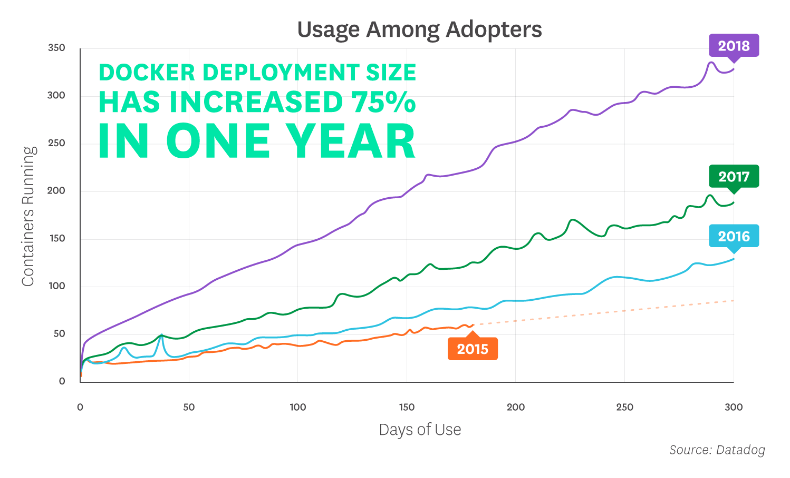

# Part 2: Container Theory

## Why use Containers?

Containers offer a logical packaging mechanism in which applications can be abstracted from the environment in which they actually run. This decoupling allows container-based applications to be deployed easily and consistently, regardless of whether the target environment is a private data center, the public cloud, or even a developer’s personal laptop. This gives developers the ability to create predictable environments that are isolated from rest of the applications and can be run anywhere.

From an operations standpoint, apart from portability containers also give more granular control over resources giving your infrastructure improved efficiency which can result in better utilization of your compute resources.

Due to these benefits, containers (& Docker) have seen widespread adoption. Companies like Google, Facebook, Netflix and Salesforce leverage containers to make large engineering teams more productive and to improve utilization of compute resources.

Some of the key uses of containers are:

* Development:
  * Developing & building applications across many different host 0Ss and infrastructure
* Building out CI/CD pipelines:
  * Encouraging a more productive & agile developer environment in the DevOps industry
  * Consistent container image moveing through the pipeline
  * Preventing "it worked in dev" syndrome
* Application Modernization & Portability:
  * Used highly when moving application from on-prem to the cloud

In organizations that adopt Docker, deployments tend to increase steadily in scale long after the initial rollout. Deployments are also growing faster than they have in the past—the average size of a 10-month-old Docker deployment has increased 75% since last year.

<A couple example use cases?>

Continue to [Part 3](Part3.md)