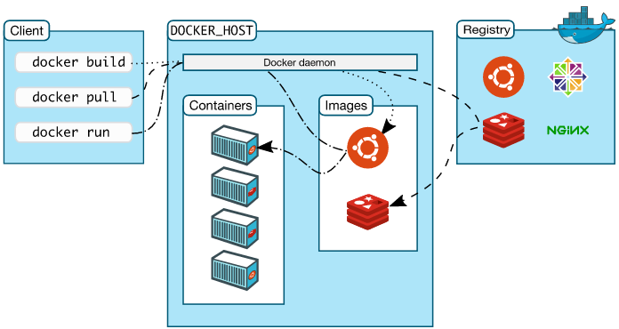

# Part 5: Docker Architecture

## Terminology

In the last section, we used a lot of Docker-specific jargon which might be confusing to some. So before we go further, lets clarify some terminology that is used frequently in the Docker ecosystem.

* ___Images___ - The blueprints of our application which form the basis of containers. In the demo above, we used the `docker pull` command to download the busybox image. Images produce a container when they run. Or you can pull an existing image from DockerHub; python image, Ubuntu image, your own application, there are hundreds. Sort of like a snapshot of the current version of the application before it has run. Once the image is on DockerHub a server can pull it, or you can run it locally on another person’s laptop. Because they can become quite large, images are designed to be composed of layers of other images, so it’s really easy to make a new image.

* ___Containers___ - Created from Docker images and run the actual application. We create a container using `docker run` which we did using the busybox image that we downloaded. A list of running containers can be seen using the docker ps command. Containers share the kernel with other containers. It runs as an isolated process in user space on the host OS.

* ___Docker Daemon___ - The background service running on the host that manages building, running and distributing Docker containers. The daemon is the process that runs in the operating system to which clients talk to.

* ___Docker Client___ - The command line tool that allows the user to interact with the daemon.

* ___Docker Hub___ - A registry of Docker images. You can think of the registry as a directory of all available Docker images. If required, one can host their own Docker registries and can use them for pulling images.

There is also one other concept which we need to know that will help us build our own Docker image;

* ___Dockerfile___ - To get started in deploying your apps using containers; everything starts with the Dockerfile that packages all the dependencies into 1 standardized unit.  The Dockerfile contains references to all source code, any installations, such as Node.js or other programs. Once the Dockerfile is created, you run a docker build command to create the docker image of the container.

TODO: explain the image below

## Lifecycle

Take a look at the image below, here is another example of the Docker workflow & lifecycle of containers. 

You begin by creating your Dockerfile and referencing all software dependencies you need for your application (we will look at creating our own Dockerfile later!).

You then run a docker build command to create the docker image. From there you can push your image to an online registry such as Docker Hub, you can also run your image in a container, you can stop, start or restart the container and also save and load your image to backup storage.

Continue to [Part 6](Part6.md)