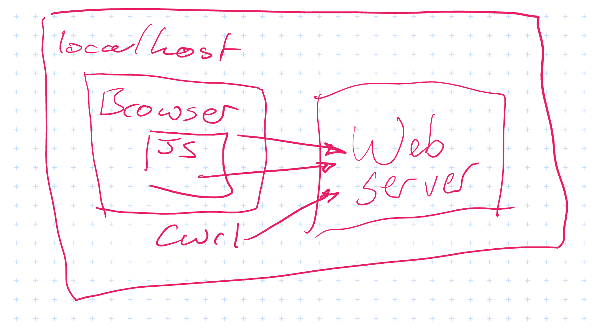
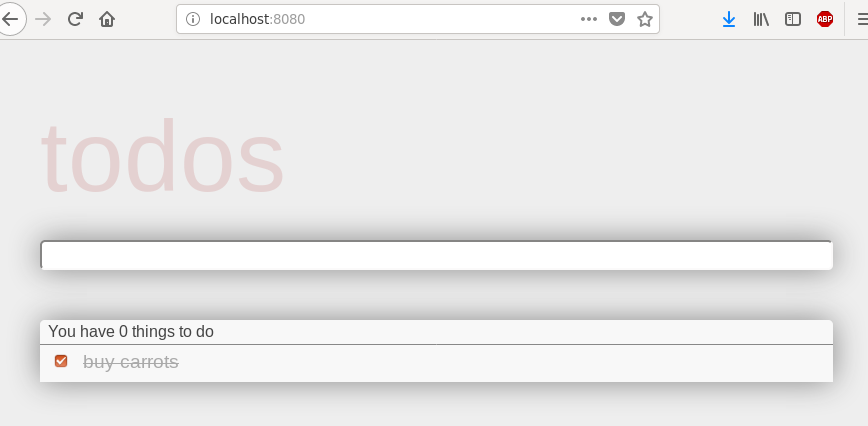
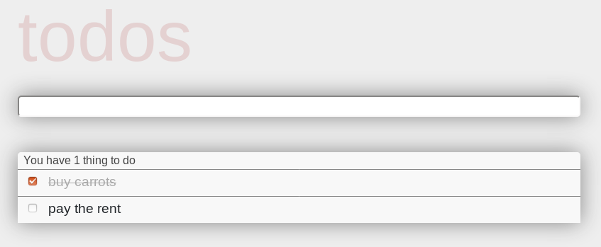
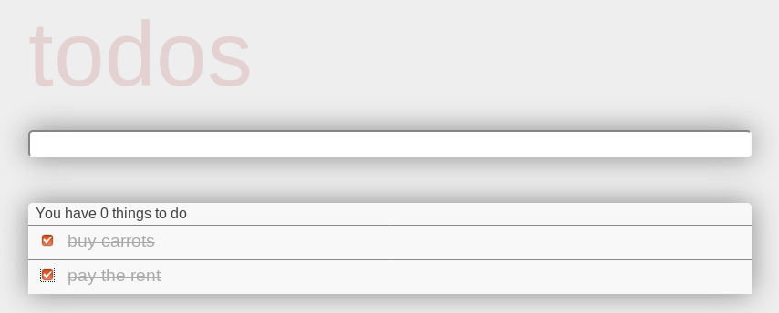
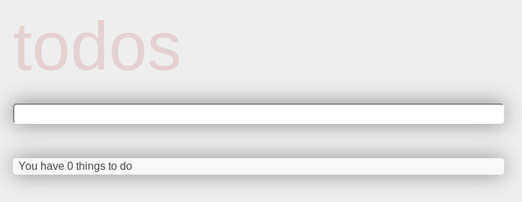
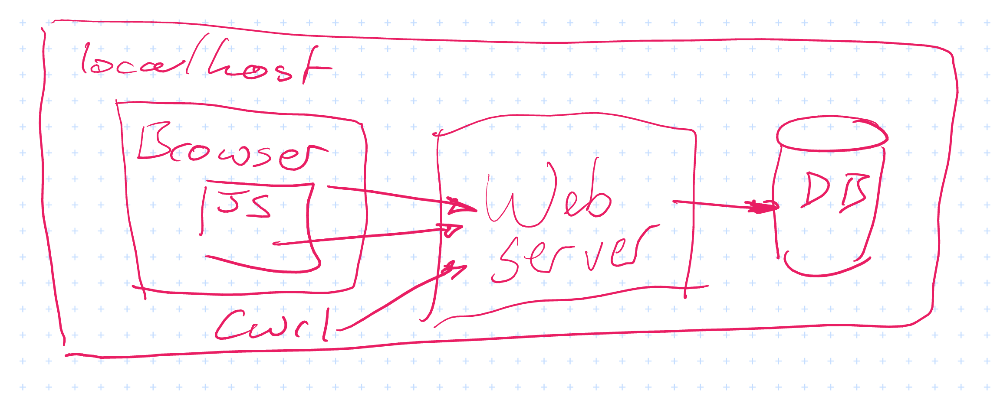
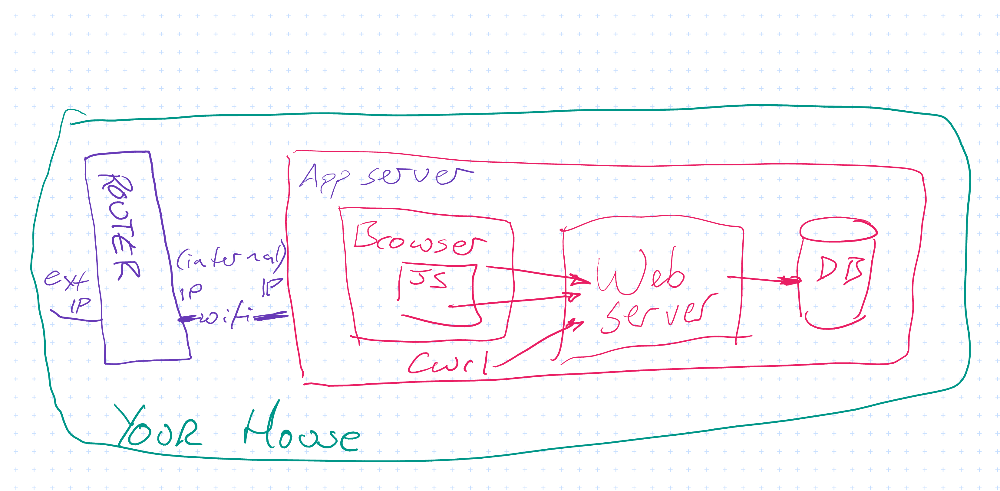
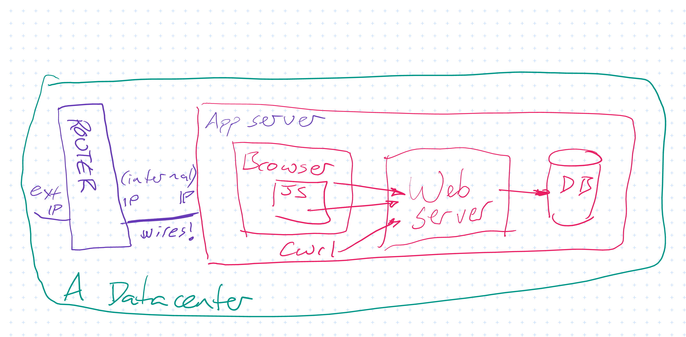
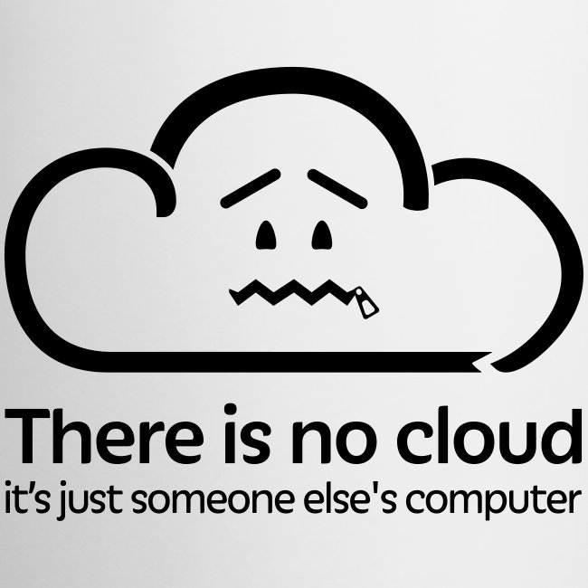

# Running software on the internet

This book is about making software that runs on the internet. Actually it's really about _running_ the software, but in order to show how to do that, we need to make some software first.

## The software we're going to run on the internet

Our example is a "Todo list" application. It's deliberately very simple, but still complex enough to show everything we need.  The source for the app, along with instructions for building it are on [the project source repo](https://github.com/MadalinaPatrichi/uob-cloud-computing/tree/master/app). We use Spring Boot, Vue.js and Gradle which are all popular choices and have good documentation.

## A "webserver"

When you're online almost everything you do uses [HTTP](https://en.wikipedia.org/wiki/Hypertext_Transfer_Protocol) to pass messages back and forth. HTTP was invented by Tim Berners-Lee in 1989 and is one of the reasons why he's considered to be the inventor of the World-Wide Web.

HTTP is a simple protocol, consisting of requests (eg "Can I have this webpage please?") and responses (eg "Yes, here it is: ......").  Here is an example, fetching `http://www.example.com/path/index.html`:

```
GET /path/index.html HTTP/1.1
Host: www.example.com
[blank line here]
```

And the webserver's response:

```
HTTP/1.1 200 OK
Date: Mon, 01 Oct 2018 09:00:00 UTC
Content-Type: text/html
Content-Length: 1563

<html>
  <title>Here's a web page</title>
  .
  .
  .
</html>
```

There is an in-depth article about HTTP with lots of examples [here](https://www.ntu.edu.sg/home/ehchua/programming/webprogramming/HTTP_Basics.html). You my also have heard of `HTTPS` which is an extension to HTTP for secure communications. The messages are the [same as regular HTTP](https://en.wikipedia.org/wiki/HTTPS#Difference_from_HTTP) but the communication is encrypted.

The next thing we need to know is where to send these messages to. Any computer which is operating as a _webserver_ needs to be listening for requests like this coming in, which is usually done with a [TCP socket](https://en.wikipedia.org/wiki/Network_socket) and it's completely possible to connect to that socket and type the HTTP request by hand using a tool like [nc](https://en.wikipedia.org/wiki/Netcat). This is generally not convenient so we will use tools to do that on our behalf. A simple command-line tool which we use in this chapter is [curl](https://curl.haxx.se/). Speaking HTTP to webservers is also one of the things your web browser does (along with displaying [HTML](https://developer.mozilla.org/en-US/docs/Learn/HTML/Introduction_to_HTML) in web pages, running [Javascript](https://developer.mozilla.org/en-US/docs/Glossary/JavaScript), remembering login details and so on).

We will not go into more detail on HTTP here, except to point out one of the lines in the response: `Content-Type: text/html`. This is important because if you're connecting from a web browser, this line instructs the browser to (try to) display the rest of the message as a web page. If the content is not a web page then this isn't the right content-type. It's extremely common to use HTTP to send small amounts of data for software to read, and a popular format for that is [JSON](http://json.org/). For this kind of response, the correct line for the webserver to include is `Content-Type: application/json`.

### How our application works

Our application uses HTTP, HTML, JavaScript and JSON to create a dynamic web application.

We have a _webserver_ which returns a `text/html` response to requests that start `GET /` - and your browser will display that HTML, first of all, as an empty list. Also embedded in that HTML page is some javascript, which the browser runs. This causes _another_ HTTP request to the webserver, starting with `GET /api/todos` - to which the server responds with a list of data as `application/json`. The javascript code then inserts that data into the webpage and we are now looking at an up-to-date Todo list!

There is also javascript code which can send new Todo items to the server, or update existing ones to tick them off. This is also done using HTTP. Requests to change something stored by the server usually start with `POST` or `PUT`, not `GET` - but the request/response process is otherwise exactly the same.

It is certainly possible for multiple clients to connect to the same web server, and we would like to make sure that one client's changes are visible to others. There are many ways to achieve this, the simplest being to just run the fetch-json-data-and-display process over and over (this is called _polling_). Our JavaScript code instructs the browser to poll the server every one or two seconds.

So, to display the Todo list, many HTTP requests and responses are flying back and forth over the network.

We can draw these components like this:



### Running the webserver and creating our first requests

There are instructions on [the project source repo](https://github.com/MadalinaPatrichi/uob-cloud-computing/tree/master/app/#app-server) which tell you how to run the webserver. Once it is running we can communicate with it using HTTP, but only if we know how to find out where it is listening for requests. It is listening on a TCP socket which is 2 things: an _address_ and a _port_. The port for our webserver is `8080` and the address for _the computer we are currently using_ is usually `localhost`.

Now we know everything we need to make our requests. To begin with we'll ignore the HTML and Javascript - lets concentrate on the JSON because it's simpler. Using curl looks like this:

```
curl -v http://localhost:8080/api/todos

> GET /api/todos HTTP/1.1
> Host: localhost:8080
> User-Agent: curl/7.58.0
> Accept: */*
>

< HTTP/1.1 200
< Content-Type: application/json
< Transfer-Encoding: chunked
< Date: Sun, 30 Sep 2018 20:12:39 GMT
<

[]
```

Here I have used `curl -v` to show the whole HTTP request and response. The response body is `[]` - an empty list in JSON - because we have no items in our list. Lets add some:

```
curl -v -H 'content-type: application/json' -XPOST -d'{"title": "buy carrots"}' http://localhost:8080/api/todos

> POST /api/todos HTTP/1.1
> Host: localhost:8080
> User-Agent: curl/7.58.0
> content-type: application/json
> Content-Length: 20
>

< HTTP/1.1 200
< Content-Type: application/json;charset=UTF-8
< Transfer-Encoding: chunked
< Date: Sun, 30 Sep 2018 20:15:13 GMT
<

{"id":1,"title":"buy carrots","completed":false}
```

(note that we have to include a `Content-Type` on what we have sent, too)

We added an item to our list by sending `{"title": "buy carrots"}` and the server has sent back what it has stored for us. The `id` and `completed` fields were added by the server for us. Now we can repeat our first request (I'll stop using `-v` with curl from now on, so we won't see any details of the request, and only the body of the response):

```
curl http://localhost:8080/api/todos
[{"id":1,"title":"my todo","completed":false}]
```

A list with one item, as expected.  We can mark it as being completed using another HTTP request:

```
curl -H 'content-type: application/json' -XPUT -d'{"title": "buy carrots", "completed":true}' http://localhost:8080/api/todos/1
{"id":1,"title":"buy carrots","completed":true}
```

Notice that we put the `id` of the Todo item at the end of the URL - so we could have changed the `title` at the same time if we'd wanted to.


### The same thing, as a web page

As explained above, we can access the same data from the web browser:



It should not be a surprise that the Todo item we created using curl is visible. Typing in `pay the rent` to the space on the page and pressing enter will give us this:



And after we have paid the rent we can check the box:



your web browser has sent the exact same kinds of requests as we sent using curl.


### The code that makes this work

The webserver is coded in Java, using [Spring Boot](https://spring.io/projects/spring-boot). Spring Boot is designed to make it easy to create web applications, and uses Java annotations to configure how the code will behave when called using HTTP. For example here is the code in [IndexController.java](https://github.com/MadalinaPatrichi/uob-cloud-computing/blob/bb7e9b55c5a1d4548c7968a1192b766e5010e79e/app/src/main/java/uob_todo/IndexController.java) which says to use the `index` template (from [the templates directory](https://github.com/MadalinaPatrichi/uob-cloud-computing/tree/bb7e9b55c5a1d4548c7968a1192b766e5010e79e/app/src/main/resources/templates)) in response to `GET /`:

```java
@Controller                         // This annotation tells Spring Boot to use this class
public class IndexController {

    @GetMapping("/")                // This sets up the mapping for GET /
    public String index() {
        return "index";             // This says to use the `index` template
    }
}
```


We are using [Vue.js](https://vuejs.org/) as a framework for our Javascript code. Vue lets us easily attach functions to UI elements, so (for example) we can send the `POST /api/todos` request when someone presses the enter key after typing a new item. Vue also does _reactive data binding_ which means that we can get and set values on the page from code by just changing the values of variables, rather than having to contstruct the HTML ourselves.

Here is an example from [TodoList.vue](https://github.com/MadalinaPatrichi/uob-cloud-computing/blob/bb7e9b55c5a1d4548c7968a1192b766e5010e79e/app/src/main/assets/TodoList.vue) which sends a new Todo item to the webserver:

```javascript
    axios.post('/api/todos', {"title": this.newTitle})  // create a new todd item and POST it
         .then(response => {
            this.newTitle = ""  // data binding means that setting this to empty will
         })                     // clear the input box at the top of the page
```

The data binding for `newTitle` looks like this:

```html
<input class="new-todo"
       v-model="newTitle"
	   v-on:keyup.enter="addTodo"
	   placeholder="What needs to be done?" />
```

Similar to the `GetMapping` shown above there are `PutMapping` and `PostMapping` annotated methods in [TodoController.java](https://github.com/MadalinaPatrichi/uob-cloud-computing/blob/bb7e9b55c5a1d4548c7968a1192b766e5010e79e/app/src/main/java/uob_todo/api/TodoController.java) which define what happens when a Todo item is created or updated. There are a few things worth noting in that class:

The contstructor for the TodoController needs an argument of type `TodoRepository`. A repository is a type of class which has methods for storing and retrieving data. Spring will construct a repository and pass it to this constructor. This technique of requiring that objects your class will use be passed to it is called [Dependency Injection](https://en.wikipedia.org/wiki/Dependency_injection), which is a great technique for simplifying code and making it easier to test.

```java
    @Autowired
    public TodoController(TodoRepository todoSource){
        this.todoSource = todoSource;
    }
```

Some methods need to read a JSON object from the HTTP request and turn it into a Java object. In fact Spring Boot does that for you automatically if you use a `RequestBody` annotation. It is also possible to extract values from the URL itself, eg the number 5 from `PUT /api/todos/5`, using a `PathVariable` annotation. so the method which is called to update a Todo item looks like this:

```java
    @PutMapping("/{id}")
    public TodoItem updateTodo(@PathVariable("id") Long id, @RequestBody TodoItem item) {
        ...
```

This can be called from code and tested just by creating a number and a `TodoItem` object - the hard work of parsing URLs and converting to and from JSON is taken care of by Spring Boot.


## Where does the data "live"?

Now you've bought carrots and paid the rent (go you!) you have time to sit and think about where the Todo items have gone. Not as a philosophical question, but literally. Somewhere in your computer, the data representing those Todo items has been stored - we can get it out again on demand, so it must be in there somewhere, right?

The answer, at the moment is rather unsettling - the data is stored _in the memory of the webserver_. If the webserver is stopped, all its memory will be freed and the Todo items will be lost forever. You can make this happen by stopping and restarting the webserver. After you've done that, reload the web page and you'll see this:



For sure, we could have written code in the webserver which stored the todo items in files on the disk, or somewhere else. But generally the best thing to do with data you want to store is to use some software specifically designed for storing data. Permanent storage of data - also called "persistence" - is a huge and complex topic, and it is almost certainly a good idea to use some datastore for persistence. A popular category of datastore is the _database_, and our app can be configured to use a database.

### Running with a database

Again, see [the project repo](https://github.com/MadalinaPatrichi/uob-cloud-computing/tree/master/app) for instructions on how to run the app with a database. You will need to install the database we use (called MySQL) onto your computer, then pass details of how to connect to the database to the webserver when you start it.

Once you have those things running together then you can create Todo items using `curl` or your the web page, and you can restart the webserver without losing your data. You can also restart the database - those really do write the data into files on the disk, so we will find the same data still exists after a restart. We might draw the application architecture like this:



In this architecture, we can refer to the webserver as being _stateless_ (in the sense that it isn't responsible for any of the application's _state_). This has a number of advantages, in particular it lets us create multiple identical webservers all connecting to the same database. This might let us server more users, and we can be confident in not losing data if a webserver crashes or hardware fails. Having multiple copies of the database is also possible - and is another good reason why we should use a dedicated database.

*Aside:* Most architecture diagrams are just boxes and lines, but databases are usually drawn as cylinders. Why? Because they store data on disks and early disks were cylindrical:


This is why Oracle (a database company originally) has buildings of that shape in its HQ:


(You might recognise the buildings the HQ of Cyberdyne systems in Terminator Genesis, too)


## Accessing the application

### Not everyone is using your computer

(so we can't use localhost forever)

### Accessing from the internet

Your computer is probably not directly connected to the internet, but connects through your router or similar at home:



Configure router to forward connections, then you can use external IP to access your application at `http://external-ip:8080/` but this isn't ideal for a number of reasons:

  - the wifi connection in your house might fail
  - your computer might get turned off by a cat
  - your ISP might decide to issue your router with a different IP address
  - your house might have a power cut
  - your ISP might not not let you have a very high upload speed

etc

TODO: Mention DNS here

To mitigate this in 2008, you would have rented some space - about the size of a pizza box - in a datacenter. Then drive there with a small computer and leave it there.:



Todo: pictures and stats about DCs

Problems which you still have:

  - HW failure
  - Scaling
  - Updating your OS
  - Updating your application
  - Paying for it


## What next?

The rest of this course is about the improvements made in the last decade or so to this state of affairs. The biggest change has been the popularization of "The Cloud". But always remember:


