# Deploying our application (the hard way)

We'll look at how we might deploy our application using the basic facilities available as _Infrastructure as a Service_ or _IaaS_ - to wit, full virtual machines and virtulalised networks.

The purpose of this section is threefold. Firstly, it'll talk you through setting up your application in an IaaS environment. Although we use OCI here, the principles should readily map to other providers.

Secondly, whilst we'll use the console for manual deployment - a very laborious process - the point is to familiarise you with the kinds of resources typically available. In particular, all of the following chapters use technologies which are built atop these facilities. Having a good mental model of how these higher-level services might be put together can be very helpful; nothing here is _magic_ (in fact, quite the opposite!)

Finally, the rather laborious process should encourage you to think about how you might improve upon this situation - how you might make such a deployment repeatable, how it might be automated - and motivate the use of tools that enable IaaS operations and VM management to be scripted.

## The Goal

At a high level, we'd like our users to be able to talk to our application over the Internet.

To put some more flesh on the bones of this goal, we'll split our application deployment into two pieces: the web tier, which serves up the JavaScript application and responds to requests from it; and the database tier, which persists client data.

Each of these pieces will be hosted on a separate virtual machine; thus, we'll need to ensure that our components can communicate successfully. We'll look at some common tools that can be used to troubleshoot that communication.

### Hosting on a VM

Each virtual machine is a close analogue to a physical host. In particular, it comes with a whole operating stack: a kernel, support libraries and packages, all of which potentially provide an attack surface to a hostile third party. Thus, a full VM comes with a management problem.

One of the successes of IaaS is that it enables us to rapidly provision hundreds - or thousands - of hosts just by running a script (you'll hear this called _infrastructure as software_). However, this multiplicity increases the maintenance problem: each of those virtual hosts may require patching!

As you progress through this chapter, you should ask yourself how you might act were a vulnerability in a critical library to be announced: what could you do to mitigate the risk? What could you do to update any deployed systems?

### Remote management

For the purposes of this chapter, we'll be managing our hosts remotely through a command-line session, using _ssh_ to interact with them directly.

_ssh_ can use a variety of different authentication mechanisms. The one we'll use here is a common one - a public/private key pair for authentication. As we boot a host, we specify the _public_ half of a keypair - which is injected into the host early in the boot process (we'll see how later). Providing that you possess the _private_ key that goes with that, you can authenticate yourself to the host.

#### ssh key generation

(This assumes you're working from a Linux or Mac desktop. If you're using a Windows host, you should look for the _putty_ tool or an equivalent and follow the instructions for key generation that are associated with it.)

    % mkdir ~/.ssh
    % ssh-keygen -t rsa -b 2048
    Generating public/private rsa key pair.
    Enter file in which to save the key (/Users/jan/.ssh/id_rsa): 
    Enter passphrase (empty for no passphrase): 
    Enter same passphrase again: 
    Your identification has been saved in /Users/jan/.ssh/id_rsa.
    Your public key has been saved in /Users/jan/.ssh/id_rsa.pub.
    The key fingerprint is:
    SHA256:FcVhmf24Lahrpcf56YT65djtKodK4kxTWOFFOo1uyIc jan@jan-Mac
    The key's randomart image is:
    +---[RSA 2048]----+
    |          o+*=   |
    |         . O+ .  |
    |          B .  o |
    |       . B .  . .|
    |        E =  . o |
    |         +  o.o .|
    |        + .=.oo. |
    |       + ++.**.o |
    |        o.+=o=Boo|
    +----[SHA256]-----+
    % cat ~/.ssh/id_rsa.pub
    ssh-rsa AAAAB3NzaC1yc2EAAAADAQABAAABAQDM+UIk50jMoHOEPReFcO+hTEPe3mfq8ow1ObCF4CM29OjixwWH5UJr08+CbkSZgs11LgYPu5QiK17sETSaWW4ZXQC88j5KzsxrgApRb84a+q9gPgGE0nmLAb2ZjGP13dX5Pu41b6vsapglci5/lALFq/by5G6fzqQtrh0m3d0mr3hRu1aE1vY1K6igy3Mj8/tyZxcN4OJkFbV4wzavmdpPPgh0LXT41bWfQDzQRlSs/nLPGIuUOlNpSInfSSvNvSz8ZtsWPQZtt1zuVMIhCwUdzF01urWw4ATkghk9GKNtze9ocGIrIcbNhSSQQiqkYnS8UdHUdfzr+MejiuefsMI1 jan@jan-Mac

The public part of your ssh keypair does not need to be kept secret.

## Booting the first VM

We begin by booting the initial virtual machine, creating a network for it to connect to as we go.

Locate the `Menu / Compute > Instances` screen in the web console. Ensure that you've selected your own _compartment_. (You can create a new compartment using the `Menu / Identity > Compartments` link, if required.)

### A note on compartments

A major challenge in dealing with large deployments is that of _namespace management_. As a simple example: for our purposes, we might want to deploy a version of our application, separately from our live (production) system.

Ideally, the smaller the differences between the test and production deployments, the greater the fidelity of our testing environment. In this case, we'd like our VMs to have the same _hostnames_, for instance, and not have to worry too much that a test web service might accidentally alter production data.

The _compartment_ is an IaaS approach to part of this problem: it acts as a bag in which a number of related resources can be collected. It's possible to apply security policies to particular compartments that restrict which users are capable of modifying which resources; in that way, you can put a barrier in the way of a developer accidentally updating a production application.

### The first VM

We'll boot a VM called `web1`. As we do this, we'll use the instance creation dialog to provision a new set of network resources to home the VM.

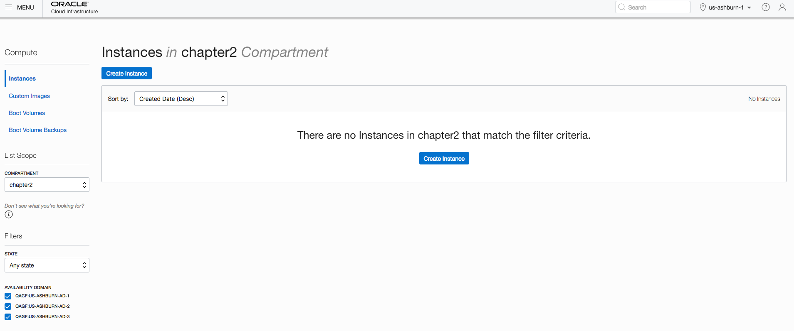

Hitting `Create Instance` will pop up a fairly extensive dialog. We'll pick the `launch in compartment` option. Let's look at the fields for the top part of the dialog:

- we pick our own compartment to host the instance
- we give it the name `web1`
- we'll use the first _availability domain_ (selected by default)
- we'll boot from an OCI-supplied image
- the image we'll use is `Oracle Linux 7.5`. (There are a couple of technical reasons for that; in particular, the instructions for package and firewall management that follow are specific to rpm-based distributions like this one.)
- we'll use a fairly small shape: `VM.Standard2.1`
- use the latest image version
- for these first machines, use the default boot volume size.

The second part of the dialog involves selecting the credentials that will be embedded into the running instance. Select `Choose SSH key files` and locate your `~/.ssh/id_rsa.pub` file.

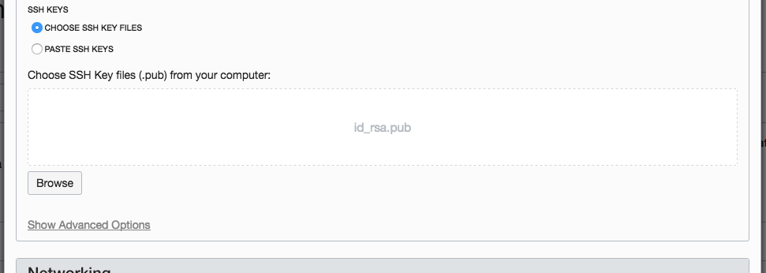

Finally, we want to create a new set of network resources to use with this VM.

- select the same compartment to host the _virtual cloud network_, or _VCN_.
- call it `net1`
- ensure that public IP addresses are assigned for hosts on that VCN
- then create the instance

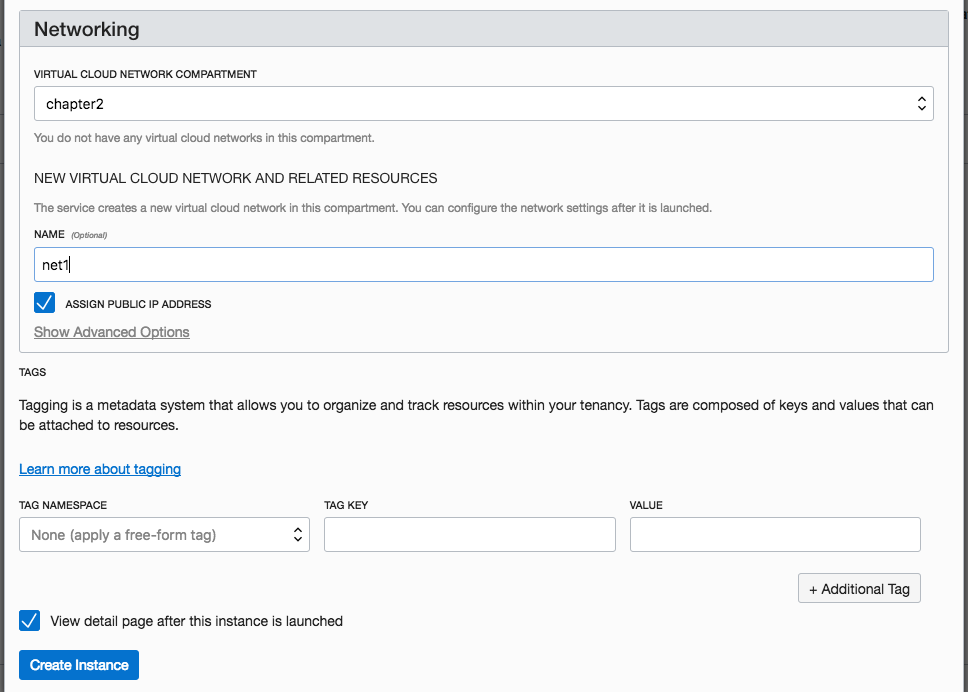

You should see a detail panel once the instance is booted. It'll look like this:

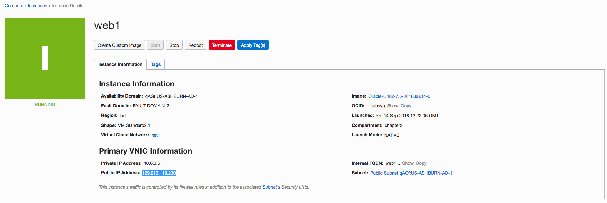

Notice that there are two IP addresses listed for the host - a private IP address and a public IP address. It's the latter that we'll use to connect to this VM over the internet.

### A note on tags

Resources can be _tagged_ with arbitrary labels. For a small deployment, this may seem unnecessary; however, for larger deployments, it can be useful to identify the various categories that a VM (or network) belongs to. Example divisions might be: _environment_ (staging, production, ...); _cost centre_; or perhaps the particular application that a resource is associated with.

## Booting the second VM

This process is very similar; we'll create the second instance (using `Oracle Linux 7.5` as the image operating system) on another small VM in the same compartment. Call it `db1`:

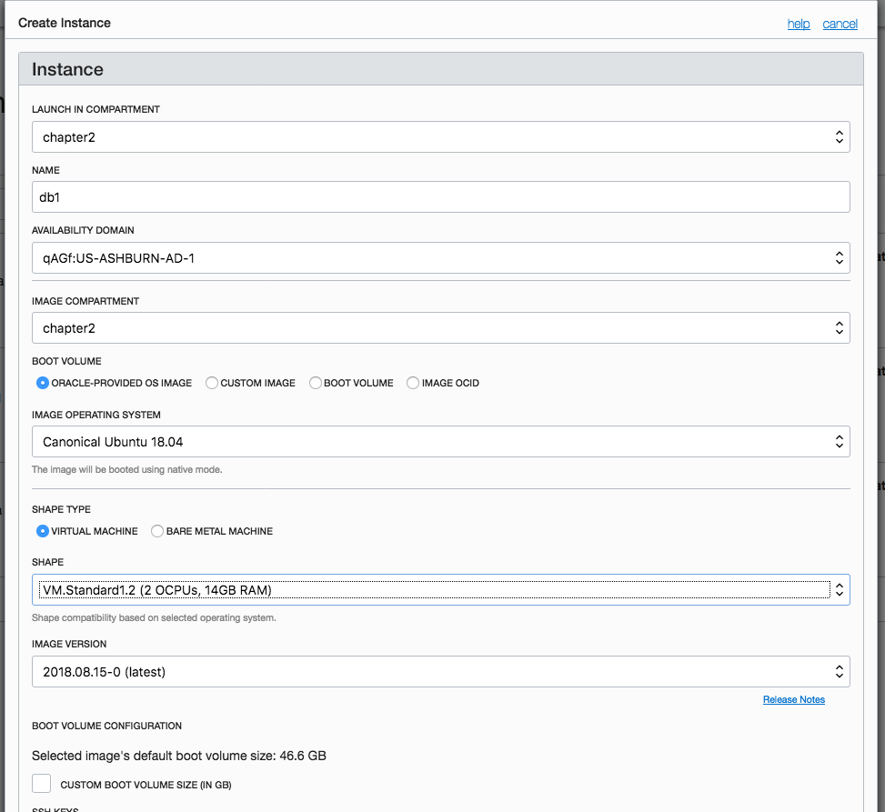

Locate the ssh public key file as before:

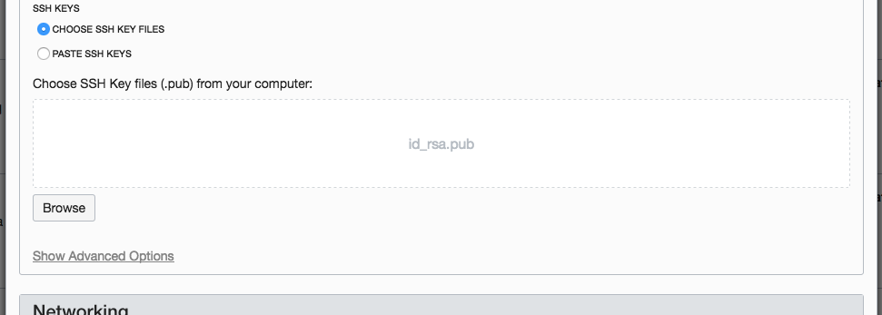

This time, we'll use the pre-existing network resources that were created in our compartment:

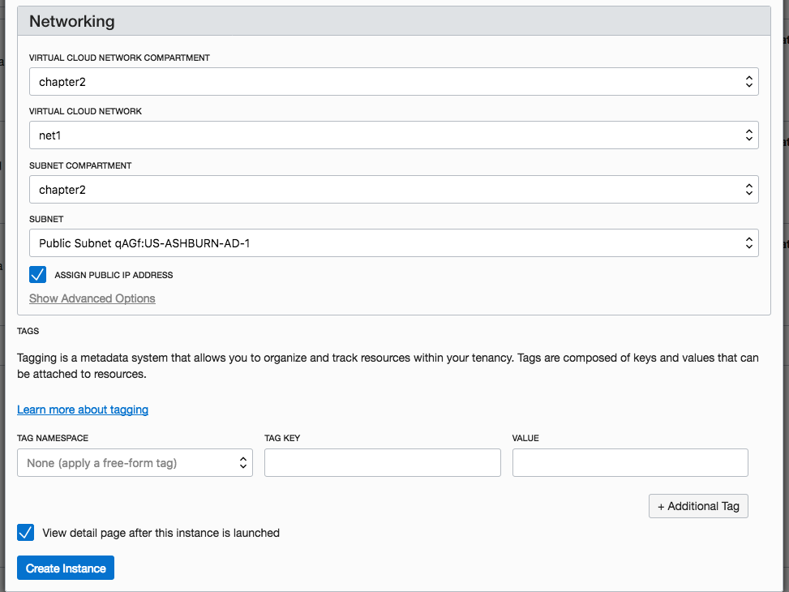

The detail page looks much like before. Take a note of the public IP address - we'll be using this to `ssh` into the instance.

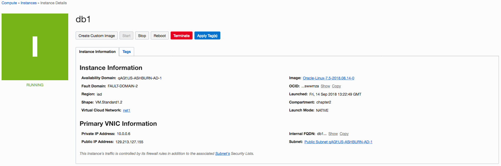

## A diagram of the result

Before we look at configuring the individual VMs that we 've brought up, let's have a look at an overall picture.

Using the console, each of the resources created during the above process can be examined; but it can be helpful to have a visual interpretation of the result of these steps, to see how the pieces fit together.

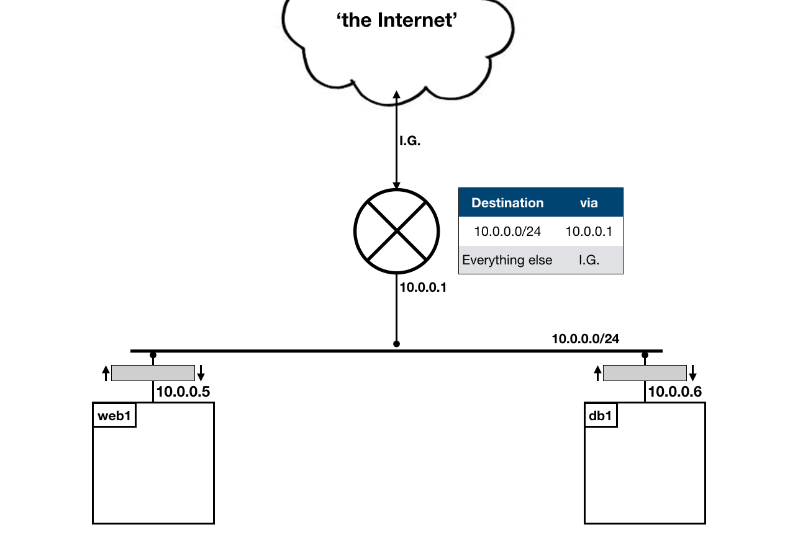

In this instance, we've booted two VMs. Those have individual network connections (called _VNICs_) onto the same _subnet_. Each VNIC has its own unique private IP address.

Each subnet has a set of _security rules_ associated with it. These can be thought of as a firewall that sits in front of each VNIC. The _security rules_ are comprised of _ingress_ and _egress_ rules. Ingress rules apply to all traffic that flows from the subnet onto the host; egress rules apply to all traffic flowing from a host's VNIC onto the subnet. (That is, the terms _ingress_ and _egress_ are relative to the host.)

Attached to the subnet is a _router_; this directs traffic (IP packets) between subnets. The router also has an IP address on that subnet; this is often referred to as a _gateway address_, since hosts on that subnet will direct traffic destined for elsewhere to that address as a 'first hop'.

The router forwards traffic by consulting a _route table_. The route table contains a list of next-hop _routes_ (there are implicit routes inserted into this table for each subnet that the router is attached to).

The default entry in the route table targets an _internet gateway_. It is this component which conceptually permits traffic to flow between the (privately addressed) subnets and the internet at large.

Each VM is configured with its internal, _private IP address_; however, those addresses are not routable over the internet. The _public IP address_ associated with a VNIC is not configured into the host's operating system. In order to understand how traffic gets to and from the internet, we need to understand how a TCP connection operates.

### Aside: the anatomy of a TCP connection

Each host involved in a TCP connection has (at least) one IP address. (Hosts that are connected to more than one subnet are said to be _multi-homed_; a router is simply a multi-homed device that can forward packets from one subnet to another.)

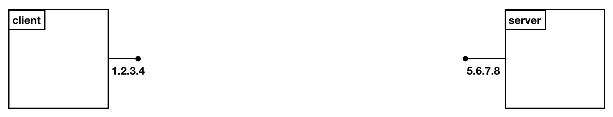

A _server_ may have several _services_ running on it. Each _listens_ on a unique _port_. Typically, well-known services have port numbers assigned to them. A port number lies in the range 1-65,535. Well-known ports are typically at the low end of that range.

Here, we see the server listening on port 22, for the ssh service, and on port 80 (the unencrypted HTTP port).

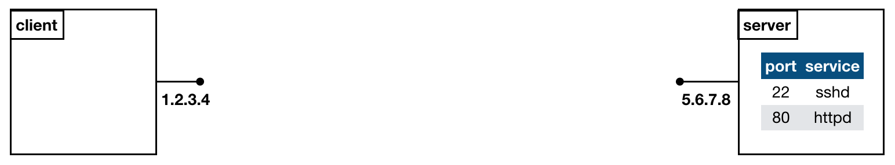

A client might want to make several outgoing calls to the same service at the same time. To distinguish them, the client also allocates an _ephemeral port_ (typically from higher in the available range).

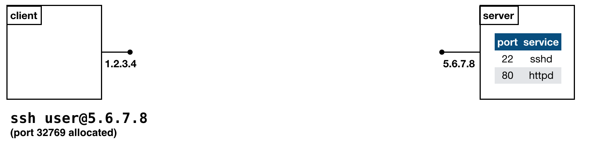

A connection is identified by a 4-tuple: (_local address, local port, remote address, remote port_). The local and remote ends of a TCP connection appear in a table maintained by the operating system of each host.

All TCP packets carry these addresses: both source, and destination.

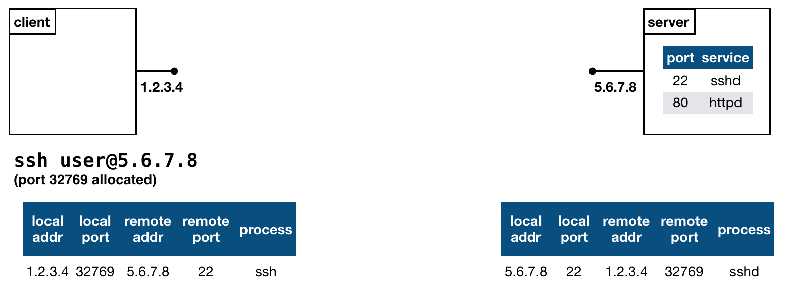

Traffic from the client carries the source and destination information one way around...

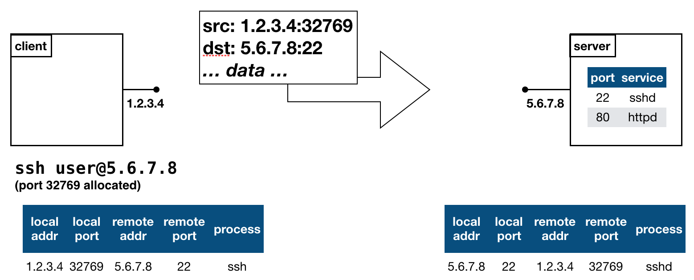

... and the return traffic carries it the other way around.

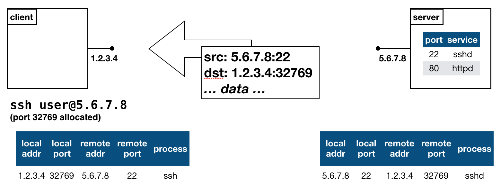

#### The Interget Gateway: Network Address Translation, or _NAT_.

When packets traverse the internet gateway, it rewrites the corresponding destination address (or source address, for outbound packets), replacing the public IP address with its corresponding private one.

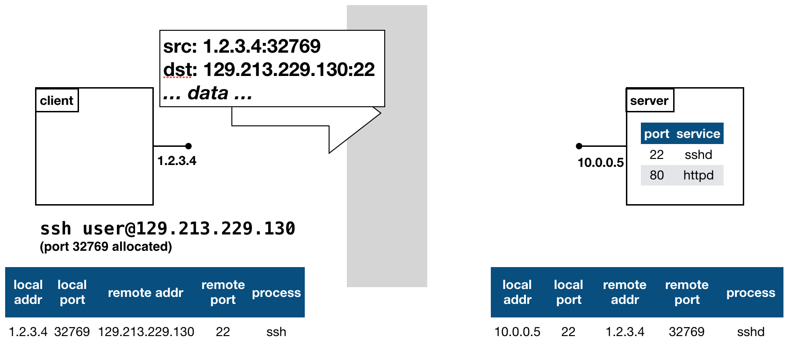

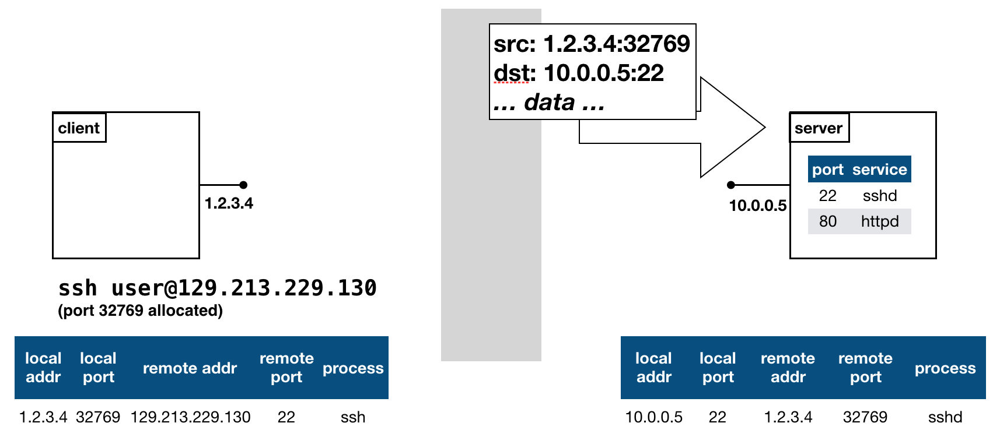

Outbound traffic gets the dual treatment.

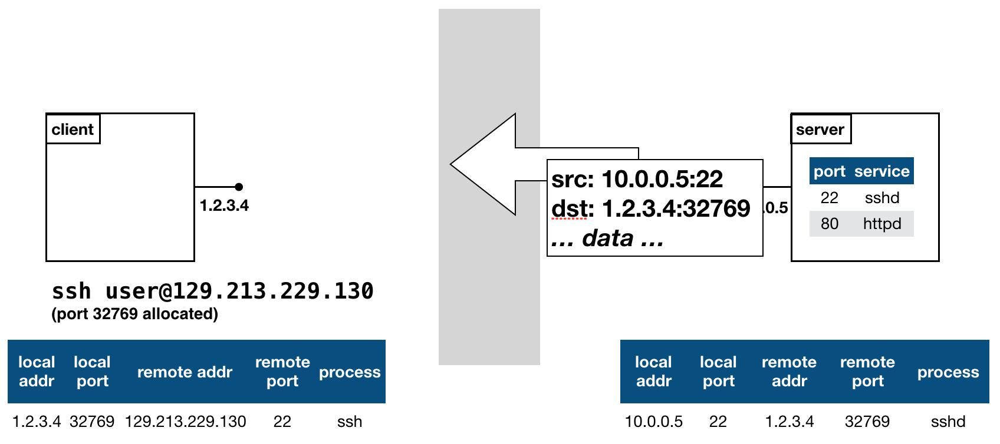

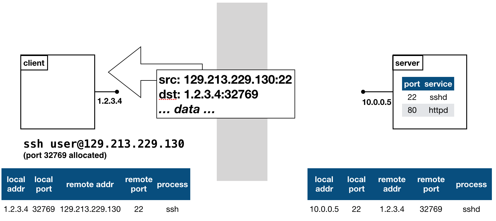

#### Inspecting the state of a VM's connection table

Armed with the above information, we can inspect these connection tables using the command `netstat`.

In the following except, we can see two server processes waiting for incoming client connections, together with an established outgoing connection to the ssh port on a remote server.

    % netstat -an46
    Active Internet connections (servers and established)
    Proto Recv-Q Send-Q Local Address           Foreign Address         State      
    tcp        0      0 127.0.0.1:3306          0.0.0.0:*               LISTEN     
    tcp        0      0 0.0.0.0:22              0.0.0.0:*               LISTEN     
    tcp        0      0 192.168.99.4:44112      192.168.99.2:22         ESTABLISHED

There are other commands that'll give you this information, but this is a common one, although its command-line parameters vary depending on the operating system. On a Mac: use `netstat -anf inet`.

### Aside: the runtime configuration of the VM

A VM is booted from a copy of an _operating system image_. That image has fixed contents (filesystem layout, boot-time daemons, etc.) However, each VM instance is differentiated from the next with a small number of run-time parameters that are typically injected during the boot process. In particular, each VM has its own IP address; this must be configured into the operating system somehow. Additionally, the public half of the ssh keypair that was supplied during instance creation needs to be installed in the filesystem in order to be effective.

#### DHCP

There is a two-stage process that takes care of this. The first part of the process takes care of network configuration. (This is the same mechanism used by a laptop to connect to your favourite cafe's fre wifi.) The protocol used is called _DHCP_.

Initially, the host does not know its IP address. It sends a broadcast packet asking for configuration information. That packet is received by the DHCP server. This is a _layer-2 broadcast_, which typically means that the DHCP server must be homed on the same subnet to receive the packet.

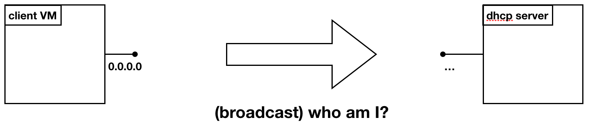

In response, the DHCP server can look up (or dynamically allocate) an IP address for the host. The response is sent directly to the host (that is, it doesn't use the typical IP mechanism for locating the host on a local subnet). This response packet contains other _DHCP options_ that tell the host how to configure itself: information about the subnet, the subnet's _maximum transmission unit_ (that is, the size of the largest packet that the subnet will accept), information about DNS (that is, the location of a local name-server), and so on.

This information comes with a _lease time_. The client host must renew its lease within that period if it wishes to retain the same IP address.

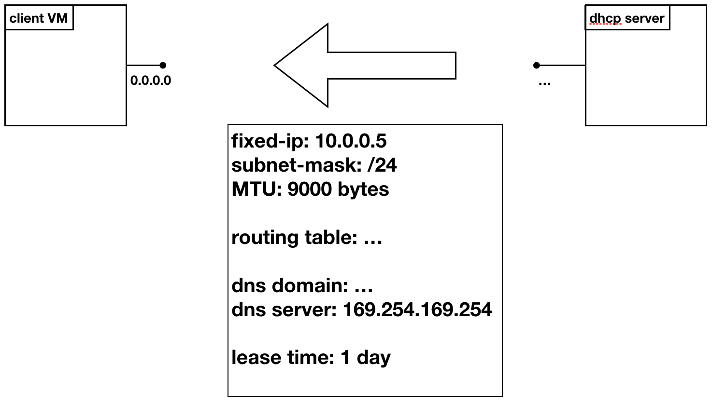

On receipt, the host configures its low-level network information.

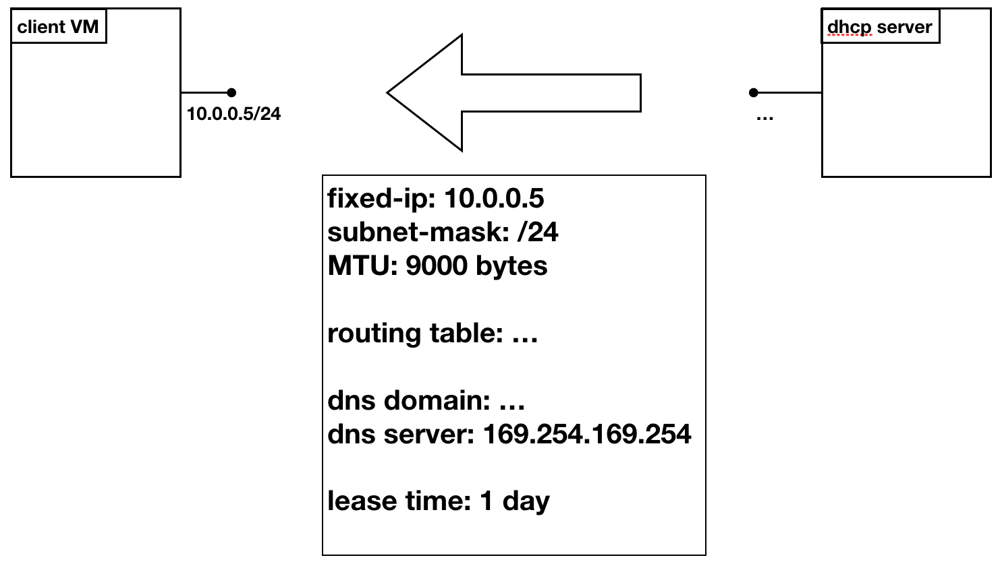

At this stage, the second part of the boot-time configuration can proceed.

#### Other host metadata

Here OS images for instances in the cloud differ from the contents of your laptop. Each image is designed to be booted in a cloud environment - possibly by an automated process - and must therefore be able to continue the configuration process automatically.

There are a small number of equivalent approaches to doing this that are typified by _cloud-init_. Here, the cloud provider and the OS image follow a conventional contract: if the VM makes an HTTP request to a given address, the cloud provider will serve up metadata in response that details the VM's specific configuration.

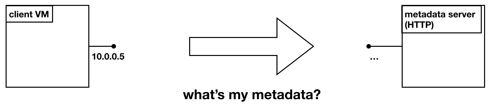

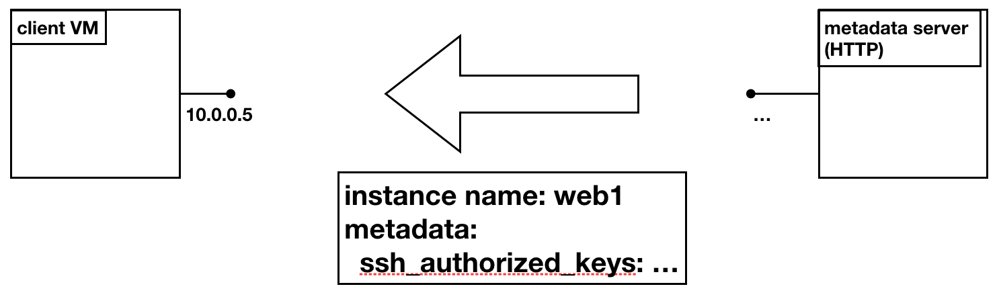

That metadata is interpreted by the boot-time process; it can cause additional configuration files to be written into the VM's filesystem, additional packages to be installed, additional user accounts to be created, and so on. One typical piece of configuration information is an _ssh key_ that is associated with the _default user_ baked into the OS image.

You'll be able to see your own ssh public key in your instance, in the `~/.ssh/authorized_keys` file, after you log into it.

## Review of the deployment plan

It's time to review the deployment plan. Having created our initial infrastructure, we need to configure these VMs.

- we are going to put a database service on `db1` to host the persistent state for our web application;
- the Java part of the application (including the JavaScript content that's delivered to the user's browser) will be installed on `web1`.

### Log in

As you work between the two VMs, it can be convenient to have a shell window open with a connection to each. In two separate terminal, launch a connection to each VM.

If you've picked Oracle Linux, the username to log in with is opc. (For Ubuntu, it's "ubuntu"; but the firewall and package management commands will be different, so the following write-up assumes the former.)

The VMs should have been configured to accept your ssh key, as we've seen.

You can log into each host by supplying the public IP address, as shown in the web console. `ssh` attempts to protect against man-in-the-middle attacks by prompting you to accept a _host fingerprint_. Once you've accepted this fingerprint, `ssh` will silently compare it on each log-in and refuse to connect if that fingerprint differs. (A cautious sysadmin may pre-distribute a set of _known host_ fingerprints through some other channel.)

You should have a pair of prompts as below: one to `web1` and another to `db1`.

    % ssh opc@129.213.119.230
    The authenticity of host '129.213.119.230 (129.213.119.230)' can't be established.
    ECDSA key fingerprint is SHA256:j01Kp0TAJTJgcKdlhecIH7b3KfghdMDoIA5viaMuNWY.
    Are you sure you want to continue connecting (yes/no)? yes
    Warning: Permanently added '129.213.119.230' (ECDSA) to the list of known hosts.
    [opc@web1 ~]$ 

(Troubleshooting: add the -v flag to the ssh command for debugging output.)

### Deploy and configure the database

We'll use the following process to deploy and configure the database:

- we'll install the database server software using an OS package;
- then we must make sure that the database service is turned on;
- the database has its own notion of user credentials. We'll need to change the _root_ password before proceeding;
- finally, we'll add credentials and an empty database _schema_ for the application to use. We expect the application itself to create the tables it needs (this is part of Hibernate's operation).

#### Aside: what's a _package_?

An _operating system package_ is simply a bundle of software, together with a default configuration for that software. There are a few dominant package formats in the Linux distribution world. The one we'll be using is based around the _rpm_ format, and is common to Redhat, Fedora, CentOS and Oracle Linux (amongst others). Debian and its derivated (such as Ubuntu) use a format called _deb_. Other formats exist; these are the commonest.

In principle, a _package_ comprises the following parts:

- clearly, there are file contents, which are unpacked into the host filesystem
- the package will also contain _metadata_, such as:
  - the package _name_ and _version_
  - a human-readable _description_
  - a set of _dependencies_ which can be automatically processed by a tool like `yum` to ensure that any requirements for a package are also installed;
  - a set of "provides", the dual concept to a dependency. A package may declare a mixture of both concrete and abstract provisions.
  - pre- and post-installation scripts that are run as the package is installed. These are typically used to integrate the package with the system configuration;
  - pre- and post-removal scripts, whose task is to undo any configuration changes as the package is removed.

A _package repository_, then, is typically a set of static files that collect the metadata and package contents for a set of packages, together with a set of cryptographic signatures that permit the installation tool to verify the package's authenticity.

### Database installation

On the `db1` host, issue the following commands. (They are presented without showing the `[opc@db1 ~]$` prompt for ease of cut-and-paste.

    # Host: db1
    sudo yum-config-manager --enable ol7_MySQL57
    sudo yum install mysql-server
    systemctl status mysqld.service 
    
We should see that the `mysqld` service is installed, but not yet activated.
    
    sudo systemctl enable mysqld.service
    sudo systemctl start mysqld.service 
    systemctl status mysqld.service 
    
The `mysqld` service should now be running.

We can check to ensure that the process is running like this:

    ps -ef
    
(look for a line containing _mysqld_ in the output).

We can confirm that the server is listening for connections from database clients:

    netstat -an46

You should see a line that indicates port 3306 is listening for connetions. (You might see this listed as `:::3306` which indicates that it will accept both IPv4 and IPv6 connections.)

### Database configuration: change the _root_ password

`mysqld` will pick a random root password when it first starts, but it'll insist that we change it.

We can locate the initial password in the mysqld _log file_.

    sudo grep password /var/log/mysqld.log 

You'll see a line like this:

    2018-09-14T14:11:29.382824Z 1 [Note] A temporary password is generated for root@localhost: b;vRuNWWq8yK

Copy that gibberish to the clipboard, then use it to log in to the database service:

    mysql -u root -p
    
You'll be prompted to

    Enter password:

you can paste in `b;vRuNWWq8yK` (or whatever the random password was). Hit _return_ to proceed.

    Welcome to the MySQL monitor.  Commands end with ; or \g.
    Your MySQL connection id is 4
    Server version: 5.7.23
    
    Copyright (c) 2000, 2018, Oracle and/or its affiliates. All rights reserved.
    
    Oracle is a registered trademark of Oracle Corporation and/or its
    affiliates. Other names may be trademarks of their respective
    owners.
    
    Type 'help;' or '\h' for help. Type '\c' to clear the current input statement.

    mysql> 

The first command that you must enter resets the root password. Use a different random password of your choice; at the `mysql> ` prompt, type:

    alter user 'root'@'localhost' identified by 'P8%aIjUxIh8:P4Wv';

You should see:

    Query OK, 0 rows affected (0.00 sec)

    mysql> 

You can enter a _control-D_ key combination to drop out of the mysql client.

#### Check it worked!

All troubleshooting is simpler if you validate each small step as you proceed. In this case, we'll immediately try logging back in using the new password.

    mysql -u root -p
    
At the `Enter password:` prompt, paste your new random password - above, this was `P8%aIjUxIh8:P4Wv`.

    Welcome to the MySQL monitor.  Commands end with ; or \g.
    Your MySQL connection id is 5
    Server version: 5.7.23 MySQL Community Server (GPL)

    Copyright (c) 2000, 2018, Oracle and/or its affiliates. All rights reserved.

    Oracle is a registered trademark of Oracle Corporation and/or its
    affiliates. Other names may be trademarks of their respective
    owners.

    Type 'help;' or '\h' for help. Type '\c' to clear the current input statement.
    mysql>

### Examine the existing schemas

`mysql` comes with a few built-in schemas:

    mysql> show databases;
    +--------------------+
    | Database           |
    +--------------------+
    | information_schema |
    | mysql              |
    | performance_schema |
    | sys                |
    +--------------------+
    4 rows in set (0.00 sec)
    
    mysql> 

### Create application credentials

We don't want to give the application total control over the database (although in this case we'll want it to be able to modify its own schema). So we'll add some credentials for the application to authenticate itself to the MySQL service:

    mysql> create user if not exists 'app'@'%' identified by 'DxIHXE%6d7sD:EXI';
    Query OK, 0 rows affected (0.00 sec)

### Create a blank database schema for the application

We'll also precreate a blank schema and grant this new user rights to modify it:

    mysql> create database app;
    Query OK, 1 row affected (0.00 sec)
    
    mysql> grant all privileges on app.* to 'app'@'%';
    Query OK, 0 rows affected (0.00 sec)
    
    mysql> flush privileges;
    Query OK, 0 rows affected (0.00 sec)
    
    mysql> ^DBye

### Confirm that the new credential work

From the same host, `db1`, we'll attempt to connect to this new database schema, using the credentials we've just created.

    [opc@db1 ~]$ mysql -u app app -p
    Enter password: DxIHXE%6d7sD:EXI
    Welcome to the MySQL monitor.  Commands end with ; or \g.
    Your MySQL connection id is 14
    Server version: 5.7.23 MySQL Community Server (GPL)
    
    Copyright (c) 2000, 2018, Oracle and/or its affiliates. All rights reserved.
    
    Oracle is a registered trademark of Oracle Corporation and/or its
    affiliates. Other names may be trademarks of their respective
    owners.
    
    Type 'help;' or '\h' for help. Type '\c' to clear the current input statement.
    
    mysql> show tables;
    Empty set (0.00 sec)
    
We can even create a new table:
    
    mysql> create table first (a integer);
    Query OK, 0 rows affected (0.02 sec)
    
    mysql> describe first;
    +-------+---------+------+-----+---------+-------+
    | Field | Type    | Null | Key | Default | Extra |
    +-------+---------+------+-----+---------+-------+
    | a     | int(11) | YES  |     | NULL    |       |
    +-------+---------+------+-----+---------+-------+
    1 row in set (0.01 sec)
    
    mysql> 

### Summary

Thus far:
- we've installed a database server;
- we've added credentials for a new user to it (and the password isn't just "secret" :-) );
- we've created a database schema for the application to use;
- we've confirmed that it works _from the db1 host_.

However, we want the Java service that will be running on `web1` to be able to communicate to this database service, too. At the moment, there are two impediments to that: the default ingress rules on this subnet prevent the connection from succeeding, _and_ a host-based firewall on `db1` will additionally prevent that communication.

In order to rectify that, we'll need to address both issues together.

### Communication between hosts

A simple tool for testing inter-host communication is `ping`. It attempts to send a single IP packet to its target, and listens for a response.

Using the `ssh` session that's logged into the `web1` host, let's try pinging the host `db1`, as follows:

    [opc@web1 ~]$ ping db1
    PING db1.sub09141050190.vcn0914105019.oraclevcn.com (10.0.0.6) 56(84) bytes of data.
    ^C
    --- db1.sub09141050190.vcn0914105019.oraclevcn.com ping statistics ---
    6 packets transmitted, 0 received, 100% packet loss, time 4999ms

There are two things to take away from this command. The first, positive thing to note is that _name resolution_ is working: our host is successfully able to turn the name `db1` into an IP address (above, that's `10.0.0.6`).

The cloud environment provides a DNS service that can resolve local host names.

However, the ping traffic itself is blocked: packets are transmitted, but are neither received by the target host, nor are any responses sent or received.

### Network security

By default, the security rules effectively look like this:

#### Ingress rules

- `ssh` traffic is permitted into a host from anywhere on the internet (this enables us to log into the host in the first place!)
- ICMP control traffic is permitted; this traffic is required for _PMTU discovery_ to work.

#### Egress rules

- traffic _from_ a VM to anywhere on the internet is permitted; additionally, since this rule is _stateful_, the response packets to any TCP connection will automatically be permitted to pass back to the VM.

However, for inter-VM communication, we require _both_ the egress rules (which currently suffice, since they target 'any host') _and_ the ingress rules to permit that traffic.

### Security rules: a firewall external to the VMs

We can examine the security rules currently in place. Locate the `Menu / Networking > Virtual Cloud Networks` page.

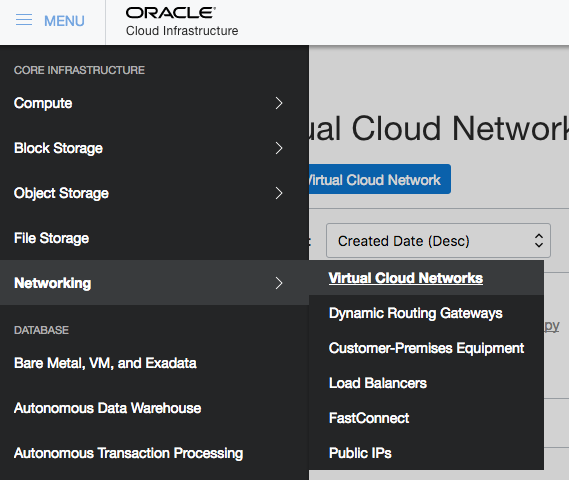

We can drill down into this to find the _security list_ attached to our subnets; this is the `Default Security List for net`. Examine the ingress rules:

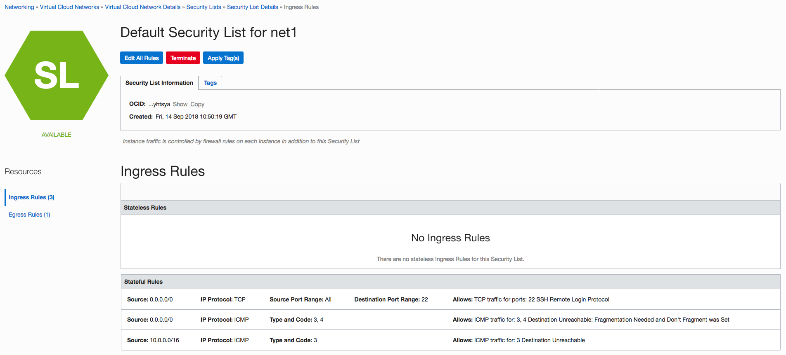

and the rather simpler egress rules:

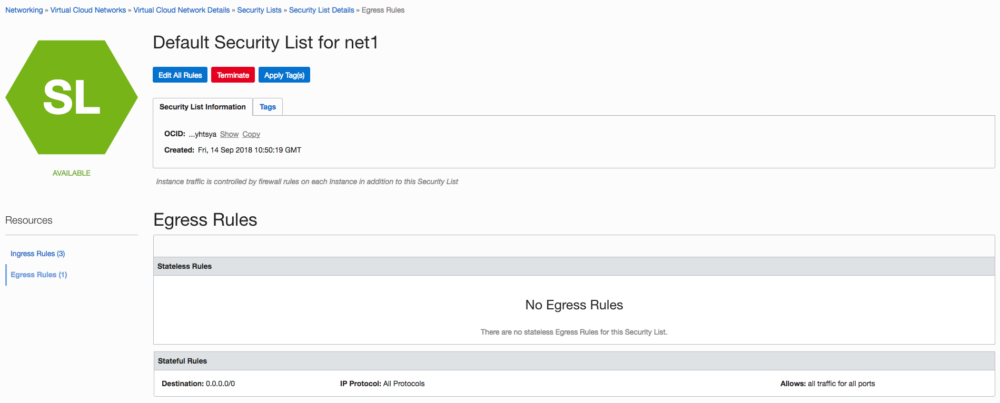

We can ask to edit _all_ rules at once. A dialog will pop open that lists both ingress and egress rules.

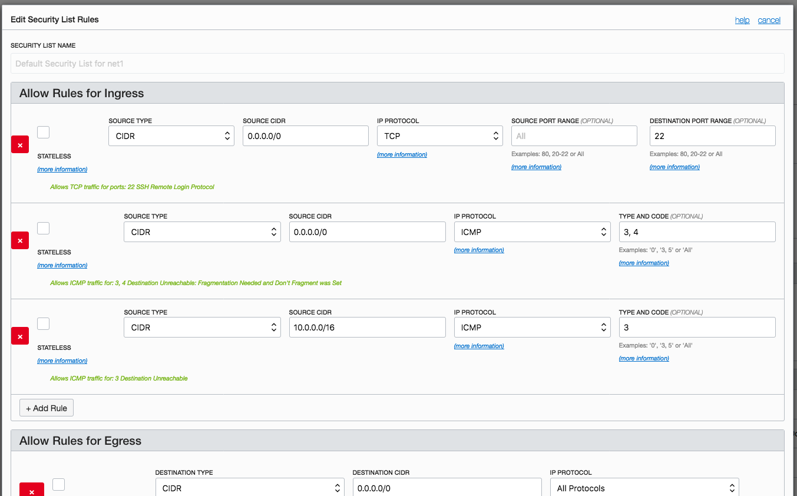

We'll make two changes. Firstly, permit _all_ ICMP traffic from hosts on our VCN (which is identified by `10.0.0.0/16`).

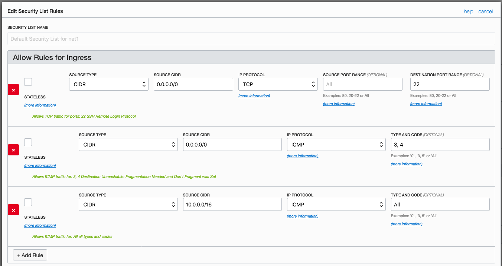

We'll also permit `mysql` traffic whilst we're here.

Wse `+ Add Rule` and add the following ingress rule:

- the `stateless` box should remain unselected
- the source type is `CIDR`
- the source CIDR (netowrk range) is `10.0.0.0/16`
- the IP protocol is `TCP`
- the _source_ port range remains unset (it defaults to `All`)
- the _destination_ port range (that is, the target port on the VM where a service is listening) should be set to `3306`. Remember, we saw that the MySQL daemon was listening on this port.

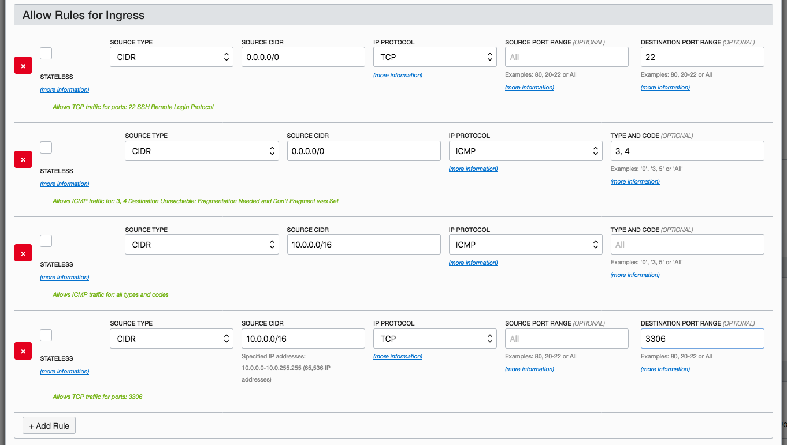

Save the new security rules to make them active.

### Ping working

That's all that is required to make `ping` work: the VMs' host-based firewalls permit ping traffic. Confirm this from the `web1` host:

    [opc@web1 ~]$ ping db1
    PING db1.sub09141050190.vcn0914105019.oraclevcn.com (10.0.0.6) 56(84) bytes of data.
    64 bytes from db1.sub09141050190.vcn0914105019.oraclevcn.com (10.0.0.6): icmp_seq=1 ttl=64 time=0.252 ms
    64 bytes from db1.sub09141050190.vcn0914105019.oraclevcn.com (10.0.0.6): icmp_seq=2 ttl=64 time=0.217 ms
    64 bytes from db1.sub09141050190.vcn0914105019.oraclevcn.com (10.0.0.6): icmp_seq=3 ttl=64 time=0.238 ms
    ^C
    --- db1.sub09141050190.vcn0914105019.oraclevcn.com ping statistics ---
    3 packets transmitted, 3 received, 0% packet loss, time 2001ms
    rtt min/avg/max/mdev = 0.217/0.235/0.252/0.022 ms
    [opc@web1 ~]$ 

### Use of _netcat_ to test low-level communication

We can check that TCP traffic is getting through (to any TCP service) using a low-level tool called `netcat` or `nc`. This simply makes a TCP connection and sends traffic through it.

We can, potentially, use netcat to talk to an HTTP server. The MySQL protocol is _not_ human-readable - it looks like gibberish. However, the simplest test is whether _any_ traffic can get across the network.

(With this kind of testing we show a simple troubleshooting process: we begin by narrowing down the scope of the communication we're testing until we find the point where it stops working.)

We can begin by using netcat locally on the `db1` host. We know that the `mysql` command-line client was able to connect to the MySQL server on this host - so we'd expect netcat to be able to do so, also. Let's try this! On the `db1` host:

    [opc@db1 ~]$ sudo yum install -y nc
    [opc@db1 ~]$ nc localhost 3306 < /dev/null
    J
    5.7.2vWHk#U4???26       *MM"mysql_native_password[opc@db1 ~]$ 
    
    
    [opc@db1 ~]$ nc db1 3306 < /dev/null
    J
    5.7.23  XG}a\#x???BG\L:9;Gysql_native_password[opc@db1 ~]$ 

This looks hopeful! Indeed, we're seeing gibberish - but it _does_ indicate that traffic is flowing over our (local) connection.

Now, let's try the same experiment from `web1`.

If you try this _before_ adding the rule to the security list, you'll see netcat hang completely:

    [opc@web1 ~]$ sudo yum install -y nc
    [opc@web1 ~]$ nc db1 3306
    (hangs)

With the security rule enabled, we see some new behaviour:
    
    [opc@web1 ~]$ nc db1 3306
    Ncat: No route to host.

This indicates that the initial TCP packet has reached the host `db1` - however, in this case, the _host-based firewall_ on `db1` has rejected the communication.

### Network security part two: host-based firewalls

These host-based firewalls represent a second line of defence. A common principle in securing systems is called `defence in depth`: if the first line is circumvented, then the next may prevent unwarranted intrusion.

In this case, however, the traffic from `web1` _is_ wanted, so we need to tell the host-based firewall to permit that traffic.

### VM _db1_: enabling access to the _mysql_ server

This configuration change must be done on the `db1` VM. Firstly, we query the firewall to ask what services it knows about.

    [opc@db1 ~]$ sudo firewall-cmd --get-services
    RH-Satellite-6 amanda-client amanda-k5-client bacula bacula-client bitcoin bitcoin-rpc bitcoin-testnet bitcoin-testnet-rpc ceph ceph-mon cfengine condor-collector ctdb dhcp dhcpv6 dhcpv6-client dns docker-registry dropbox-lansync elasticsearch freeipa-ldap freeipa-ldaps freeipa-replication freeipa-trust ftp ganglia-client ganglia-master high-availability http https imap imaps ipp ipp-client ipsec iscsi-target kadmin kerberos kibana klogin kpasswd kshell ldap ldaps libvirt libvirt-tls managesieve mdns mosh mountd ms-wbt mssql mysql nfs nfs3 nrpe ntp openvpn ovirt-imageio ovirt-storageconsole ovirt-vmconsole pmcd pmproxy pmwebapi pmwebapis pop3 pop3s postgresql privoxy proxy-dhcp ptp pulseaudio puppetmaster quassel radius rpc-bind rsh rsyncd samba samba-client sane sip sips smtp smtp-submission smtps snmp snmptrap spideroak-lansync squid ssh synergy syslog syslog-tls telnet tftp tftp-client tinc tor-socks transmission-client vdsm vnc-server wbem-https xmpp-bosh xmpp-client xmpp-local xmpp-server
    [opc@db1 ~]$ 

Hidden in that list is the `mysql` service (associated with port 3306). This firewall configuration item was one of the things that MySQL's package contained.

Let's permit external traffic to the `mysql` service:

    [opc@db1 ~]$ sudo firewall-cmd --add-service mysql
    success
    
Having done that, we can check the status of the running firewall as follows:

    [opc@db1 ~]$ sudo firewall-cmd --list-all
    public
      target: default
      icmp-block-inversion: no
      interfaces: 
      sources: 
      services: ssh dhcpv6-client mysql
      ports: 
      protocols: 
      masquerade: no
      forward-ports: 
      source-ports: 
      icmp-blocks: 
      rich rules: 

If we're satisfied with that configuration, we can make it permanent; that means that it'll survive a reboot. Making these configuration changes 'live' and only persisting them once we're satisfied that they're working is a suitable approach here: if we made an error (for instance, turning off ssh access) then we could reboot the VM through the web console to revert the firewall to a known-good state.
        
    [opc@db1 ~]$ sudo firewall-cmd --runtime-to-permanent

let's try that netcat check from host `web1` again:

    [opc@web1 ~]$ nc db1 3306 < /dev/null
    J
    5.7.23
    OCiQu&???
             NE1yd}pmysql_native_password[opc@web1 ~]$ 

That looks promising. Now we know that traffic is passing between our `web1` host and the MySQL service running on `db1`. The next step is to ensure that the credentials that we've set up work from the `web1` VM.

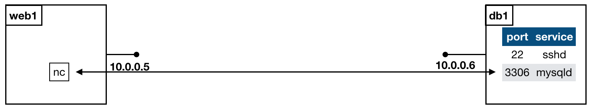

### Testing from the VM _web1_ with the _mysql_ command-line client

We'll install the `mysql` cpommand-line client on `web1`. This is unnecessary to make our application work, but it's useful for testing purposes:

    [opc@web1 ~]$ sudo yum install -y mysql
    [opc@web1 ~]$ mysql -u app -h db1 app -p
    Enter password: 

Paste the password that we configured in here.
    
    ...
    
    MySQL [app]> describe first;
    +-------+---------+------+-----+---------+-------+
    | Field | Type    | Null | Key | Default | Extra |
    +-------+---------+------+-----+---------+-------+
    | a     | int(11) | YES  |     | NULL    |       |
    +-------+---------+------+-----+---------+-------+
    1 row in set (0.00 sec)
    
    MySQL [app]> 

### Summary

At this point:
 
- we have permitted enough network communication between VMs that processes on the `web1` VM can successfully get traffic through to the MySQL service running on `db1`;
- we've _demonstrated_ that we can talk to the database service from the host where we'll be running our application.

The implication here is that our application, appropriately configured, should also be able to communicate with the database. Let's do that next.

### Deployment: install the Java application

We have two options for deploying the `.jar` file. We can either build it on a laptop and upload it to the `web1` VM; _or_, we can download the prebuilt `.jar` file from GitHub and use that.

In order to run the Java application, we'll need a _JRE_ (Java Runtime Environment). This we'll install from an OS package.

With those prerequisites in place, we'll begin by launching the application directly from the command-line, then finally look at how we can get it to automatically restart (like the MySQL service does).

### Getting the `.jar` file

As a pre-requisite to this stage, you should have built (and run) the application locally.

Copy the jar file up to `web1` from your laptop:

    % ./gradlew build    
    % scp build/libs/uob-todo-app-0.1.0.jar opc@129.213.119.230:
    uob-todo-app-0.1.0.jar                                              100%   33MB 588.2KB/s   00:58

This uses the `scp` tool, which communicates over the ssh protocol. (Clearly I used a slow network connection!)

### install a _JRE_ on _web1_

This is done with another `yum` invocation:

    [opc@web1 ~]$ sudo yum install -y java-1.8.0-openjdk-headless
    ...
    Complete!

As always, we can check progress incrementally. Confirm that the JRE is now available:

    [opc@web1 ~]$ java -version
    openjdk version "1.8.0_181"
    OpenJDK Runtime Environment (build 1.8.0_181-b13)
    OpenJDK 64-Bit Server VM (build 25.181-b13, mixed mode)

### Running the Java application directly from the command-line

We can launch the application directly - although it'll only run until we press Control-C or close the ssh session. You should be able to cut and paste a line like the following to do this. (The `\ ` at the end of a line tells the shell you've not finished typing yet.)

    java \
         -Dspring.datasource.url=jdbc:mysql://db1:3306/app \
         -Dspring.datasource.username=app \
         -Dspring.datasource.password='DxIHXE%6d7sD:EXI' \
         -jar uob-todo-app-0.1.0.jar

You'll need to embed the appropriate credentials into this command-line.

You should see some output from the application as it starts up:

      .   ____          _            __ _ _
     /\\ / ___'_ __ _ _(_)_ __  __ _ \ \ \ \
    ( ( )\___ | '_ | '_| | '_ \/ _` | \ \ \ \
     \\/  ___)| |_)| | | | | || (_| |  ) ) ) )
      '  |____| .__|_| |_|_| |_\__, | / / / /
     =========|_|==============|___/=/_/_/_/
     :: Spring Boot ::        (v2.0.3.RELEASE)
    ... a lot of output elided here ...
    2018-09-28 16:36:38.271  INFO 4980 --- [           main] uob_todo.Application                     : Started Application in 12.263 seconds (JVM running for 13.23)

### Testing locally with _curl_

We can use a command-line HTTP client like `curl` to test that our application is working. Thus far, we've done nothing to permit ingress traffic to the port that our application listens to - so, our test will have to connect locally, from `web1`. Open a second ssh session (whilst the first is still running the application), install `curl` and try it:

    [opc@web1 ~]$ sudo yum install -y curl
    ...
    [opc@web1 ~]$ curl http://localhost:8080
    <!doctype html>
    <html>
    <head>
        <title>My page</title>
        <link rel="stylesheet" href="/styles.css">
        <link rel="stylesheet" href="/main.css">
    </head>
    <body>
    

    
    </body>
    </html>

Success!

### Another look at the database

As our application started up, Hibernate should have set up tables in our schema. We can examine the database to confirm this. On the host `db1`, reconnect to the MySQL database as the `app` user (you'll need to paste that password in again). Let's see what the schema looks like:

    mysql> show tables;
    +--------------------+
    | Tables_in_app      |
    +--------------------+
    | first              |
    | hibernate_sequence |
    | todo_item          |
    +--------------------+
    3 rows in set (0.00 sec)
    
    mysql> describe todo_item;
    +-----------+--------------+------+-----+---------+-------+
    | Field     | Type         | Null | Key | Default | Extra |
    +-----------+--------------+------+-----+---------+-------+
    | id        | bigint(20)   | NO   | PRI | NULL    |       |
    | completed | bit(1)       | YES  |     | NULL    |       |
    | title     | varchar(255) | NO   |     | NULL    |       |
    +-----------+--------------+------+-----+---------+-------+
    3 rows in set (0.00 sec)
    
Those new tables were programmatically created by our application.

### Configuring the Java application to run as a daemon

The next step on `web1` is to set up our application to launch itself automatically on boot. We'll configure a _systemd unit_ to do this. The plan is as follows:

- the systemd unit will be responsible for launching the application;
- it will read the password from a file;
- we'll run the application as the `opc` user (the user we've logged in as);
- the application will still listen on port 8080.

#### Put the password into a file

On the host `web1` copy and paste the following lines:

    cat <<'EOF' > ~/app.password
    APP_PASSWORD=DxIHXE%6d7sD:EXI
    EOF
    
You can check the contents of that file by typing `cat app.password`.

#### Create the systemd unit file

A full explanation of _systemd_ unit definitions is beyond the scope of this chapter - but documentation can be readily found online. We'll create the unit file by copying and pasting the following lines into the shell on `web1`:

    cat <<'EOF' | sudo tee /etc/systemd/system/app.service
    [Unit]
    Description=Sample Java application
    After=network.service
    
    [Service]
    Type=simple
    EnvironmentFile=/home/opc/app.password
    ExecStart=/usr/bin/java \
      -Dspring.datasource.url=jdbc:mysql://db1:3306/app \
      -Dspring.datasource.username=app \
      -Dspring.datasource.password=${APP_PASSWORD} \
      -jar /home/opc/uob-todo-app-0.1.0.jar
    Restart=never
    StandardOutput=journal
    StandardError=journal
    TimeoutStartSec=300
    User=opc
    Group=opc
    
    [Install]
    WantedBy=multi-user.target
    EOF

(The shell will probably insert a continuation prompt like `> ` as you go; this can be safely ignored.)

#### Ensure the new unit is set to run on reboot

    [opc@web1 ~]$ sudo systemctl daemon-reload
    [opc@web1 ~]$ sudo systemctl enable app

#### Start the application

Before you start the application using `systemd`, you should ensure that the version you ran manually has been stopped. If it isn't, then the unit will fail to start, since another process will already be listening on port 8080.

    [opc@web1 ~]$ sudo systemctl start app

#### Check the unit's status

    [opc@web1 ~]$ systemctl status app
    ● app.service - Sample Java application
       Loaded: loaded (/etc/systemd/system/app.service; enabled; vendor preset: disabled)
       Active: active (running) since Fri 2018-09-28 17:18:00 GMT; 14s ago
     Main PID: 6420 (java)
       CGroup: /system.slice/app.service
               └─6420 /usr/bin/java -Dspring.datasource.url=jdbc:mysql://db1:3306/ap...
    
    [           main] o.s.b.w.embedded.tomcat.TomcatWebServer  : Tomcat st...ext path ''
    Sep 28 17:18:13 web1 java[6420]: 2018-09-28 17:18:13.971  INFO 6420 --- [           main] uob_todo.Application                     : Started A...for 13.014)
    Hint: Some lines were ellipsized, use -l to show in full.

If the application is running (you can look for the `java` line in the output of `ps -ef` and check that it's listening using `netstat -an46`), try connecting to it again:

    [opc@web1 ~]$ curl http://localhost:8080
    <!doctype html>
    <html>
    <head>
        <title>My page</title>
        <link rel="stylesheet" href="/styles.css">
        <link rel="stylesheet" href="/main.css">
    </head>
    <body>
    

    
    </body>
    </html>

### Permit inbound traffic to port 8080

In order for our installed application to serve traffic over the internet, we'll need to open up the host-based firewall on `web1` to let traffic in to port 8080. Additionally, we'll need to add a security rule permitting ingress traffic from all hosts to that port.

#### The host-based firewall configuration

    [opc@web1 ~]$ sudo firewall-cmd --add-port 8080/tcp
    success
    [opc@web1 ~]$ sudo firewall-cmd --list-all
    public
      target: default
      icmp-block-inversion: no
      interfaces: 
      sources: 
      services: ssh dhcpv6-client
      ports: 8080/tcp
      protocols: 
      masquerade: no
      forward-ports: 
      source-ports: 
      icmp-blocks: 
      rich rules: 
        
    [opc@web1 ~]$ sudo firewall-cmd --runtime-to-permanent
    success

#### An additional security rule

Locate the security list via the web console again, edit all rules, and add the following entry:

- the ingress rule should not be stateless
- source type is `CIDR`
- source CIDR is `0.0.0.0/0` (this means, "everything")
- IP protocol is `TCP`
- source port range is blank (`All`) - remember, the source port is selected randomly from the ephemeral range by the client
- the destination port range is `8080`

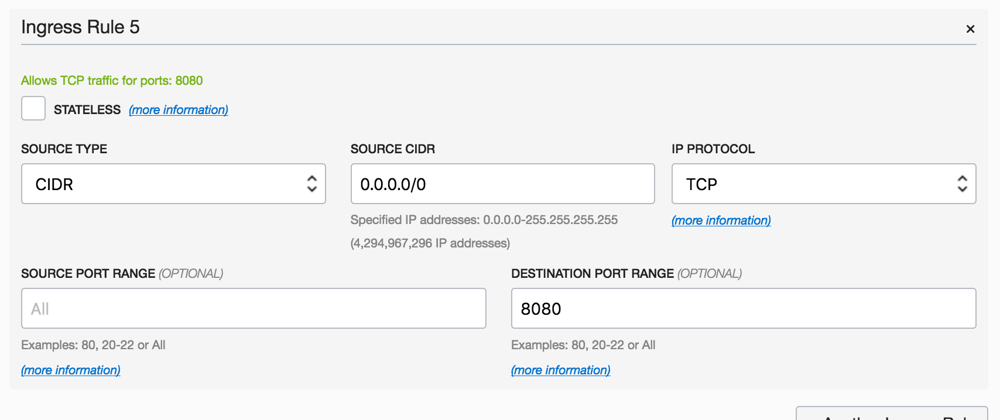

Don't forget to save the security list.

#### Check the connectivity

We can now try to connect to host `web1` from across the internet. We'll need to use `web1`'s public IP address to do this:

    % curl http://129.213.119.230:8080
    <!doctype html>
    <html>
    <head>
        <title>My page</title>
        <link rel="stylesheet" href="/styles.css">
        <link rel="stylesheet" href="/main.css">
    </head>
    <body>
    

    
    </body>
    </html>

If this works, we can put the same URL (we'll need to port specification also) into a browser: `http://129.2113.119.230:8080`.

### Troubleshooting checklist

To review: by taking small steps and checking as we progress, we have a systematic way to deploy the application.

If "it doesn't work!" then we'll want a step-by-step process of diagnosis, looking to confirm that each piece of our architecture is working, slowly expanding the scope of our investigation until we discover what's broken:

- Is the process started? Is it still running?
  - `systemctl status` or `ps -ef`
- Did it crash?
  - Check logs (look in /var/log or use `journalctl`)
- Is it listening?
  - `netstat -an46` or `lsof`
- Can I communicate to the service _locally_?
  - `nc` or a specific protocol client, like `mysql` or `curl`
- Can I talk to it from another VM? If not:
  - Check the host firewall on the VM hosting the service
  - Check the _ingress_ security rules for the subnet of the target VM
  - Check the _egress_ security rules for the subnet of the client VM
- Can I talk to it from across the internet?
  - Again, we can use appropriate tools here
  - also ask: "should I be able to?" For instance, there's no reason why we'd need to be able to make a connection to our MySQL service _across the internet_. If we _can_, then so can attackers!
- Can this component talk to its dependencies?
  This is application-specific, but:
  - Are any embedded credentials correct?
  - Can you make a connection to the same service from the same VM?

## Locating the application on the web

We've successfully published the application on the internet; but there are still some deficiencies. Most notably, IP addresses are neither memorable nor convenient. (The situation only becomes worse with IPv6 addresses, which are four times the size.)

DNS has been mentioned previously as a way of hosts looking up IP addresses that correspond to names. We've seen that the cloud provider arranges for 'local' hostnames to be resolvable to their private IP addresses by VMs located on our subnets (`db1` mapping to `10.0.0.6`, for instance). The global _Domain Name System_ lets us perform the same operation over a global, distributed database of names.

### A typical DNS request - local names

Each VM has a local DNS server (whose details were supplied by DHCP). When a process on the VM wants to look up a local name, such as `db1`, it's first qualified with the configured local domain name. (In our case, this'll be something like `db1.sub09141050190.vcn0914105019.oraclevcn.com`; those names are taken from the subnet and VCN names - which were autogenerated for us when we asked for this VCN to be automatically provisioned on the boot of our first VM.) Note, this name is _not_ resolvable from the wider internet - answers to lookups for this name are only served to local requests originating within our VCN.

(That makes sense, since the IP addresses returned are all private ones that aren't routable over the Internet.)

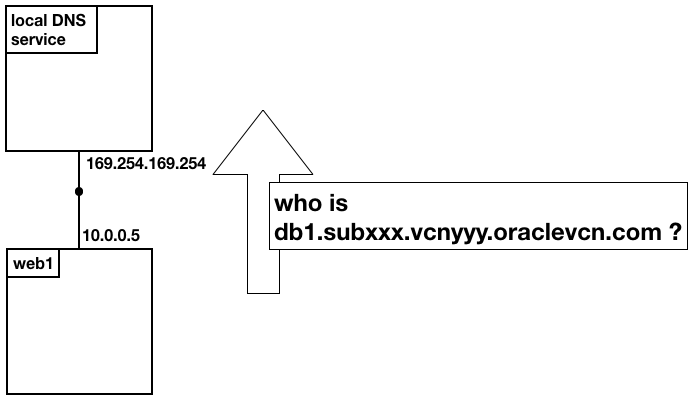

The local nameserver responds with an _A record_, which gives the *IN*ternet *A*ddress (or _A record_) of `db1`. The record comes with a _Time To Live_ or _TTL_ of 300 seconds. The host won't make another request for this name within that period.

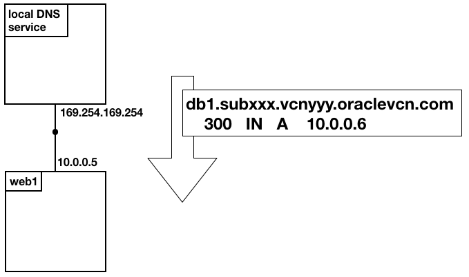

### A typical DNS request - global names

For names that are in the global DNS, the initial request hits the local resolver as before.

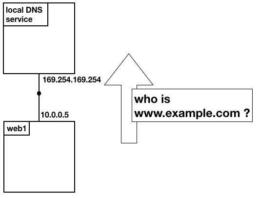

If it doesn't already know the answer, the local resolver will ask the _global root server_ the same question.

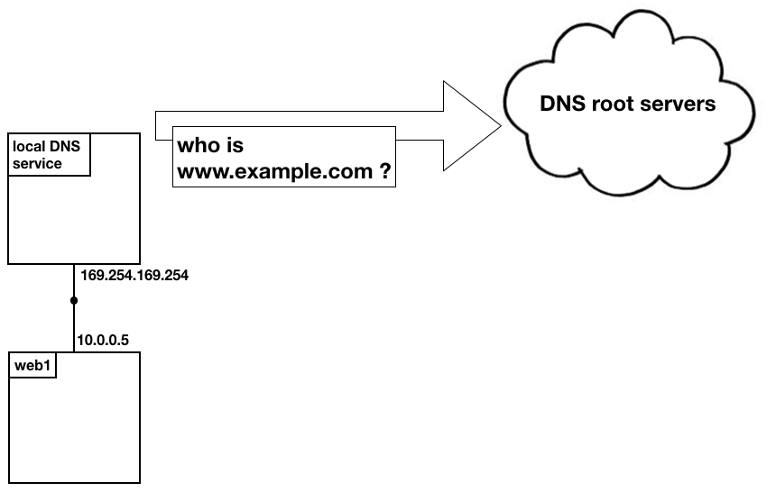

The global root servers don't have an answer - but they _do_ know about the `com.` _nameservers_, and respond to effectively say, "you might ask here". 

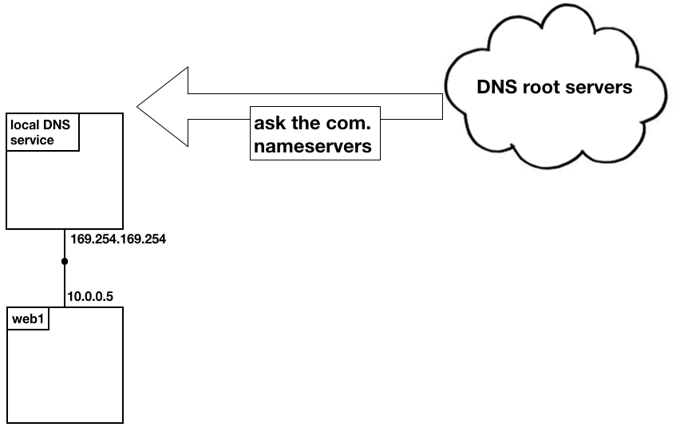

The local reoslver continues to ask its question, directing the query as instructed.

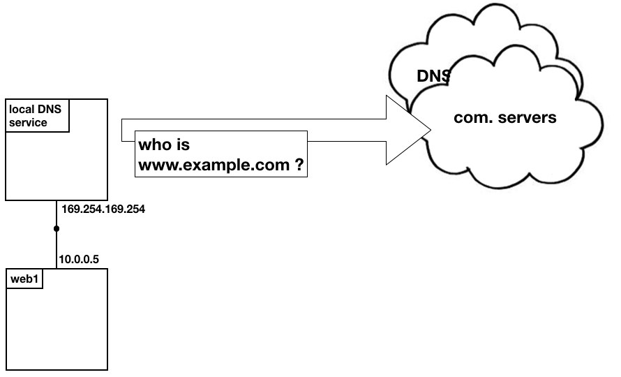

Again, the `com.` nameservers don't necessarily know the answer - but they _do_ know the address of a more specific nameserver, for `example.com.`.

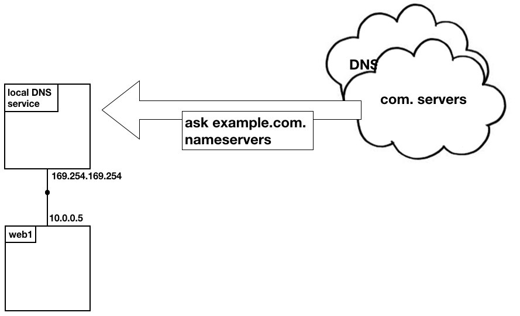

When the local resolver asks those nameservers the same query...

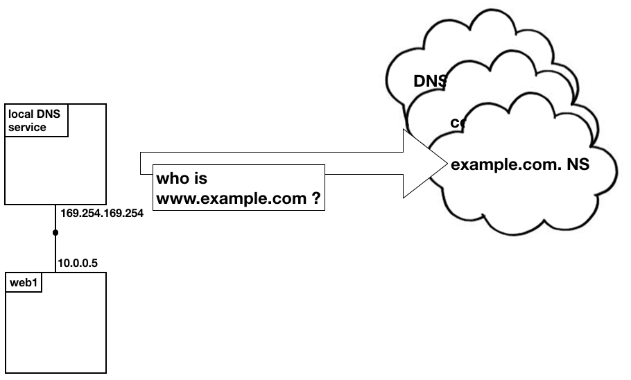

... they get a usable A record in response. Here, the TTL is about six hours. DNS tends to trade off the consistency of up-to-date responses for low latency; caching is built into its design.

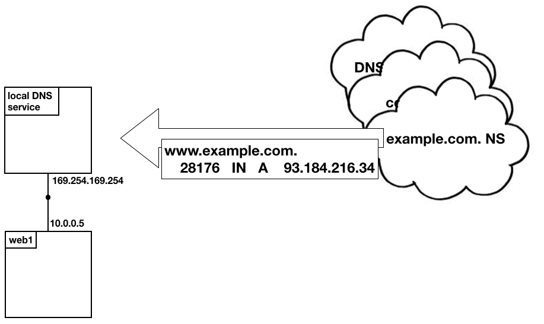

That A record is then returned to the process on the local VM, supplying the requested A record.

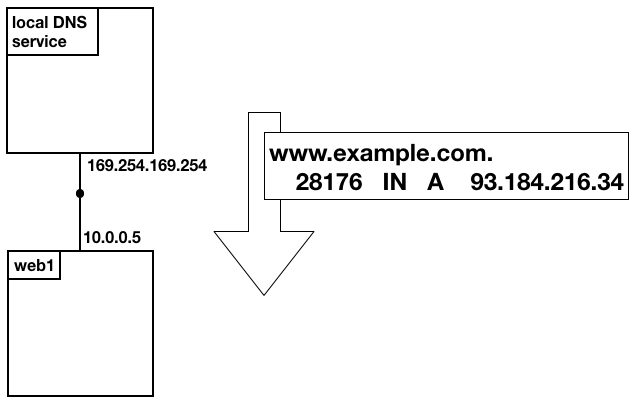

### Configuring your own domain

There are two parts to acquiring a new domain. The first is its registration; the second is to arrange the hosting of _nameservers_ which will serve up DNS responses for your domain. Typically, most domain-name vendors will offer both of these as a package. (They'll usually offer a whole range of other services that you may not want to take advantage of.)

#### Purchase the domain

Arguably the main challenge here is finding a good domain name that's available. Assuming we can find such a beast, we'll use an arbitrary reseller to manage the transaction.

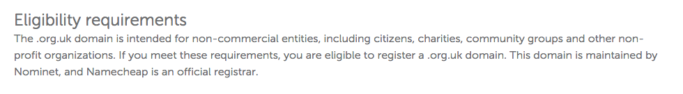

NOTE: the following sequence of screenshots were taken using a suggested reseller for the domain in question; no recommendation, positive or negative, should be implied. Navigating the control panel of these vendors may vary in the details, but the basic process should be similar in each case. The screenshots are illustrative; they all come from a vendor who displays the following assertion: _"The entirety of this site is protected by copyright © 2001–2018 Namecheap.com."_

Let's go looking for a domain name. You're on your own here!

For this example we just want the based registration and simple DNS hosting.

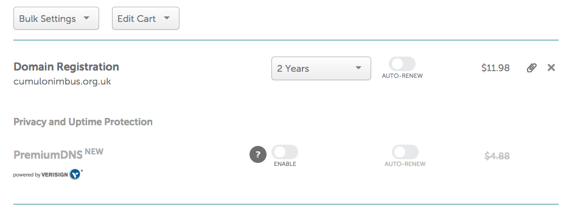

The following should suffice...

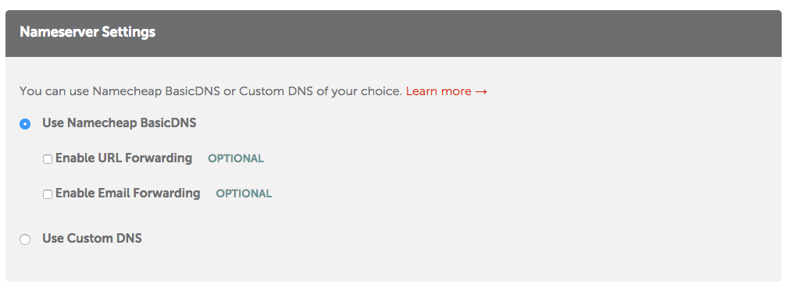

Time to hand over some money. As a ballpark indication of cost, this isn't far off the mark.

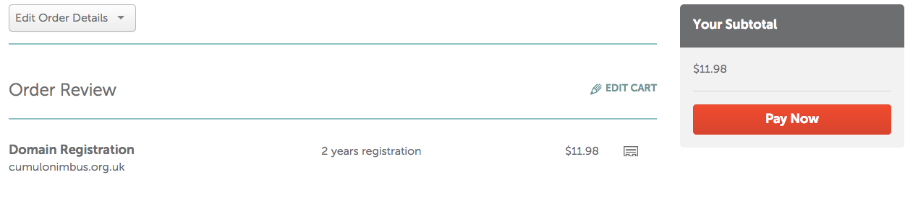

Once the domain is registered, the `Manage` option is readily available. Let's try it.

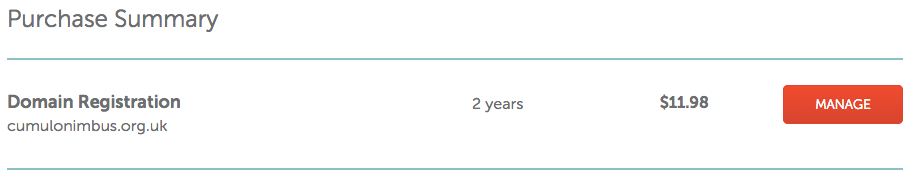

#### Set up one or more A records

The domain management page offers a typical web control panel. The "Advanced DNS" tab looks like the one we're after. It defaults to looking like this:

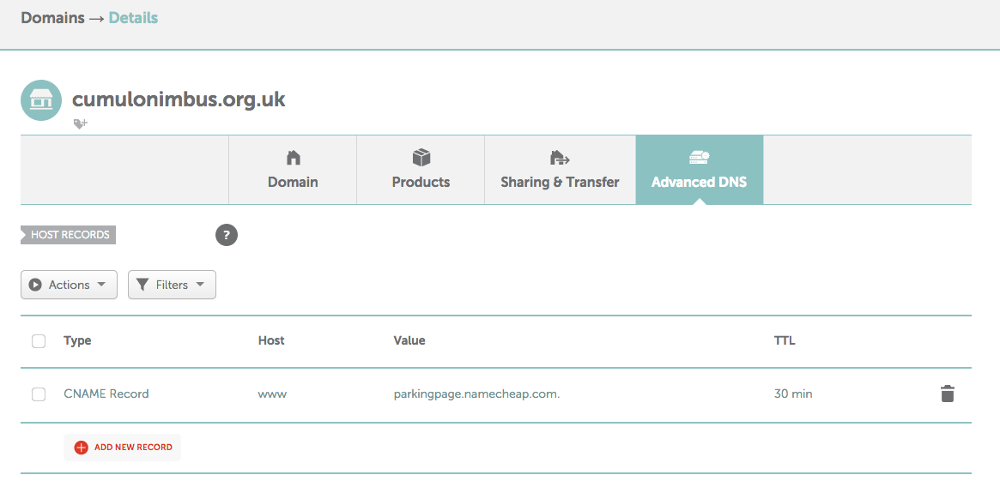

I'll add an `A Record` and then remove the `CNAME` one. The `Host` field is unusual: `@` is DNS-configuration slang for _this domain_. The value for the A Record is the public IP address of my host (or load-balancer - see below).

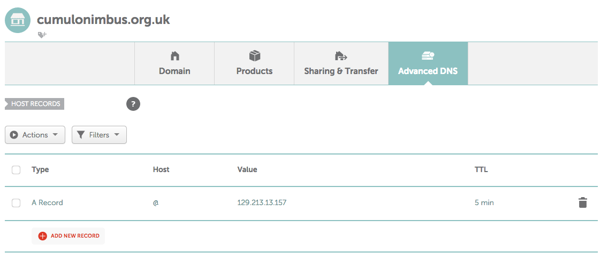

### Examining DNS using _dig_

These days, the above process produces results almost immediately. We can use the `dig` tool to query for our new domain results:

    [opc@db1 ~]$ sudo yum install -y bind-utils
    ...
    Complete!
    [opc@db1 ~]$ dig cumulonimbus.org.uk. a
    
    ; <<>> DiG 9.9.4-RedHat-9.9.4-61.el7_5.1 <<>> cumulonimbus.org.uk. a
    ;; global options: +cmd
    ;; Got answer:
    ;; ->>HEADER<<- opcode: QUERY, status: NOERROR, id: 9204
    ;; flags: qr rd ra; QUERY: 1, ANSWER: 1, AUTHORITY: 2, ADDITIONAL: 1
    
    ;; OPT PSEUDOSECTION:
    ; EDNS: version: 0, flags:; udp: 4096
    ;; QUESTION SECTION:
    ;cumulonimbus.org.uk.		IN	A
    
    ;; ANSWER SECTION:
    cumulonimbus.org.uk.	300	IN	A	129.213.13.157
    
    ;; AUTHORITY SECTION:
    cumulonimbus.org.uk.	528	IN	NS	dns1.registrar-servers.com.
    cumulonimbus.org.uk.	528	IN	NS	dns2.registrar-servers.com.
    
    ;; Query time: 104 msec
    ;; SERVER: 169.254.169.254#53(169.254.169.254)
    ;; WHEN: Wed Oct 17 13:06:31 GMT 2018
    ;; MSG SIZE  rcvd: 123

Now we can try pointing the browser at `http://cumulonimbus.org.uk:8080`; the next task is to get rid of that extra port specification.

### Summary

- We've installed the application using two VMs
- We can connect to it from the outside world
- We know how to plumb it into DNS if required.

## Extenstions: Scalability

We've deployed the application on a single VM, talking to a single database server for persistence. This isn't completely satisfactory: we're gaining no benefit from a deployment across multiple _availability domains_ for robustness; nor are we able to scale up to deal with additional load.

Adding additional web servers is a straightforward task, which we'll look at next.
 
(The scaling out of the persistence layer is a more complex topic which won't be covered here: the goal is to give a flavour of the options, not a comprehensive list. However, it's worth noting that in general, the horizontal scaling of deployment components which don't contain their own _shared state_ is a simpler process. If multiple requests from a single client might be delivered to a multiple VMs, then those VMs must find a way to agree on the state that they present to the client. How can we ensure they are in sync?)

For these stateless web servers, however, we can simply stand up and configure more VMs and put them behind a _load-balancer_. This involves several configuration steps within the OCI console - so let's examine a schematic first to get the goal in mind.

### Adding a load-balancer

The following diagram illustrates the configuration items that need to be set up. For the moment, we'll just focus on putting our single VM behind a load-balancer; adding additional _backends_ is a mechanical process. The main advantage we'll glean from this is that the loadbalancer will forward requests aimed at the standard HTTP port, port 80, to our back ends: so, correctly configured, the URL that we're using can drop that port specification.

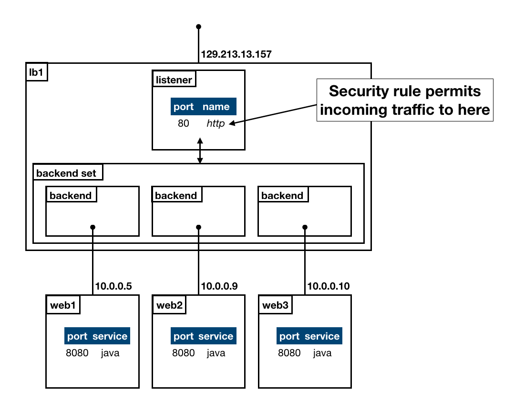

Our VM on web1 listens on a given port, port 8080. Inside the load-balancer configuration, we have a _backend set_ that coceptually collects the VM endpoints that are responsible for delivering a particular service.

To the _backend set_ we add a _backend_, which has a one-to-one association with our VM (and which targets the Java application listening on port 8080). The backend also has a notion of _health_; we can specify a check that the load-balancer will use to determine if a particular VM is currently capable of serving traffic.

We couple this with a _listener_ specification, which is configured to accept incoming requests over port 80 and distribute them over healthy backends.

Finally, we'll want to update the security list configuration for our VCN. The web console can automate some of this; we want to permit the loadbalancer traffic to reach the backend VMs - and we want requests arriving from the Internet to reach our load-balancer listener.

### Adding a load-balancer through the console

Navigate to `Menu / Networking > Load Balancers`.


Create a new load balancer. We'll give it another predictable name, `lb1`. We only need 100Mbps service here, although the load balancers themselves are capable of running at wire speed up to 10Gpbs.


We'll need to associate the loadbalancer with our VCN. For redundancy, public-facing load balancers require two subnets to attach to; we'll use our existing subnets in AD1 and AD2.


Once created, an (empty) loadbalancer detail is presented.


We'll need to add a backend set to it.


Again, we have some options to fill in. Because our backend set is distributing HTTP traffic, we'll call it `http` - although this isn't a requirement. We'll leave the other options unselected.


Our backend set defines a health-checking policy. We'll ask it to try to make an HTTP request to each backend, every five seconds, and expect an HTTP 200 status code in response. The URL requested should ideally not require a large amount of computation from our VM - but it _should_ be indicative that the service is working.


This gives us an empty backend set.


It has no backends. 

It's somewhat clunky, but we associate backends with their corresponding VM by using the VM's _OCID_ (its unique identifier). Locate `web1` via `Menu / Compute > Instances` and copy its OCID to the clipboard.

(The whole OCID is a long, random string.)

Find our backend definitions again via `Menu / networking > Load Balancers`. Add a backend and identify `web1` by pasting its OCID into that field. The service will be listening on port 8080.


As the request is submitted, we're asked if we want to add security rules automatically to support this load balancer traffic. 


We absolutely want this! Hit `Create Rules`.


Now our backend set should have a single backend, associated with our running VM.


We'll want a listener to front this.


Again, the name is pretty arbitrary. We'll ask for TCP load balancing; this makes the load balancer distribute traffic without inspecting its contents. We'll pick the backend set that we've just created to target.


The resulting detail page of our configured load balancer. Note, it has its own public IP address. Make a note of this!


We can examine the new ingress and egress rules that have been added to our security list. There's one more step required to enable Internet traffic to reach our load balancer.


We need to edit ingress rule 5 - which is the one that permitted traffic directly to the Java application on `web1` - and instead change the destination port to port 80. That's the port the listener is responding on.


### Checking: via IP address

To confirm that traffic is flowing, we'll try targetting the public IP address of our load balancer. From your laptop:

    % curl http://129.213.13.157 
    <!doctype html>
    <html>
    <head>
        <title>My page</title>
        <link rel="stylesheet" href="/styles.css">
        <link rel="stylesheet" href="/main.css">
    </head>
    <body>
    

    
    </body>
    </html>

### Optional: checking via DNS name

If you've registered a domain name, you can edit its _A Record_ to have the same value. With that done, you should be able to point your browser at your new, neater URL: `http://cumulonimbus.org.uk` in our case.


## Extensions: scaling and robustness in the persistence layer

We'll not cover this here. In the modern world, there are many strategies to spread the load over a series of persistence backends: for example, MySQL can be configured in a _multi-master_ arrangement to offer an HA deployment across three ADs. Beyond that, you might want to examine what structured storage options are available via the PaaS offerings of your cloud provider. (It all depends on whether you're enjoying the _undifferentiated heavy lifting!_)

## Food for thought: service continuity

We've not really touched yet on the question of service continuity and availability. Decisions here should be largely driven by the economics of one's business model - and any compliance requirements imposed upon you as a service provider.

At the very least, you may want to consider taking backups of your persisted content. There are various mysql tools that can dump the state of the database to a file; this could be uploaded to a bucket in the _Object Storage Service_ as a bare minimum.

It's an old truism, but when looking at this you should bare in mind the following two-part adage:

- a backup plan is not complete without a recovery plan
- a recovery plan doesn't work unless you've tested it

Beyond the question of backups, however, we should really focus on the question of _service availability_. A great deal has been written about this. It may well be the case that decisions here will have an impact upon your application architecture. The kinds of questions that you should be asking yourself are:

- What does my data represent?
- How important is it that it's fresh (consistent, versus available)?
- How long an outage can I tolerate?
- ...of what fraction of data?
- How secure are copies?
- Do I need a transactional history?

## Extensions: regional scalability

Not all Internet traffic needs to cross the Atlantic. For reasons of geographical robustness, legal compliance, and lowering client latency (and potentially, our own traffic costs), we should consider GeoDNS.

GeoDNS has a simple model in principle. As requests arrive to DNS servers, they carry a _source address_ - the address of the requesting nameserver. The assumption is that that nameserver is going to be geographically closely located to the client. There exist databases that map regions of public IP address space to geographical location; from these, we can make a guess at where the client responsible for a particular request is located.

If we then send a DNS response that carries the A record of a deployment in a local data-centre, the client's requests will be directed to, and can be served by, a geographically close instantiation of our infrastructure.

This sounds great, but there are a couple of downsides, aside from a higher level of configuration complexity.

The first issue concerns what happens if an entire region becomes unavailable. In those circumstances, the GeoDNS servers will need to be reconfigured to direct client traffic from the affected regions to a backup location. There's a tension here between the desire for liveness and the caching properties of DNS. If I want a user's traffic to be impacted for no more than 60s, that puts an upper limit on the TTL of my DNS responses. That in turn will mean a higher DNS load. It's an interesting observation that the ready availability of cloud infrastructure itself is exerting pressures on well-established technologies.

The second issue raises a question of our data architecture: again, we're looking at a tradeoff between consistency (the liveness of the data we present) and latency. In particular, we should ask what happens if a user's session with one datacentre is interrupted. It's common to have an asynchronous process for replicating state between sites; we need to understand the semantics of that in terms of what the user experience is.

(As an example, it's no big deal if the "add this series to my list" feature looks five minutes out-of-date in the case that my streaming TV provider experiences a partial outage; indeed, most users probably wouldn't notice.)

## Extensions: monitoring

If we're running a service, then it behooves us to be able to answer the question, "is it up?" There are more nuanced variations on this question, however, which rely on us establishing our _Service Level Objectives_.

It's not necessarily simply the case that user requests can be serviced; we often want to guarantee that we are servicing those requests rapidly enough.

We may also want to look at individual components of our deployment, rather than relying on _black box_ monitoring. Is our database struggling? What kinds of query rates is it experiencing? How does that compare to a historical view?

### From within a cluster

We can instrument the parts of our application to deliver metrics to a collection point. Various tools (such as _Prometheus_) are available to collect and collate this data.

### Offsite monitoring

We may also want to extend our black-box monitoring to alert us to problems across the wider internet; our internal monitoring process may be fine within a datacentre, but that doesn't account for problems the Internet may be experiencing in routing traffic to that datacentre.

It's not an uncommon tactic, with a multi-region deployment, to have each instantiation of our architecture set up to monitor its peers.

## Extensions: security

At the moment, we're delivering unencrypted HTTP traffic from port 80.

In the modern world, there's an onus upon us to protect the traffic (as well as the data at rest) of our users. At the very least, we should consider enabling _TLS_ service from our web application.

TLS configuration is beyond the scope of this chapter, but we'll offer a basic outline of a few broad approaches. the first is to _terminate secure connections at the boundary_ - that is, to configure our load balancers with TLS certificates, and to have them handle the negotiation of that secure protocol.

The second option is to tunnel a client's encrypted traffic all the way to our VMs.

Finally, we might use a hybrid approach: terminating external TLS at the load balancer, but delivering internally-encrypted traffic to our VMs.

### "Let's Encrypt"

A simple service that enables more-or-less hands-off encryption is called "Let's Encrypt". There are various tutorials that walk through the use of a Let's Encrypt certificate with a java server.

# Automation

By now, it should be clear that setting up our infrastructure using a combination of a web console and `ssh` is a painful, fiddly, and error-prone process. It's a process that we might try once, but surely there's a better way?

In fact, there are a plethora of "better ways" that fit within the IaaS model. To begin with, the OCI console (like most other cloud providers' consoles) simply fronts a REST API that will accept programatic requests. So at a bare minimum, we could effetively _script up_ our infrastructure creation using tools that talk to that API (and scripted `ssh` invocations - almost everything that was done within an `ssh` session in this chapter was designed to require a limited level of interaction). Where we have configuration that needs to be shared between VMs (for instance, our MySQL password was needed on `db1` _and_ `web1` - in the former case to configure the application's credentials, and in the latter to actually make client connections to the database) we can write scripts that ensure the appropriate secrets are distributed effetively and reliably.

But we can go beyond this; tools that help us move towards a more declarative approach of _describing what we want_ and then _determining the changes required_, and _applying that plan_ are available. Largely, they will fall into two categories:
 
- tools that help us establish our infrastructure. These are the moral equivalent of "clicking in the web console"; and
- tools that help us configure individual VMs. These are the moral equivalent of `ssh` sessions.

There are also tools that attempt - with more or less success - to combine both of these. Of interest may be:

- Terraform. This falls into the first category (although it can also run scripts over ssh sessions). It lets us define an infrastructural layout in a declarative fashion, then makes changes to a deployed architecture to make those changes live.

  Terraform does tend to be an all-or-nothing option, however: it is fiddly to try to get it to automate _some_ pieces of a deployment whilst integrating with other, preconfigured parts. If you find yourself wanting to do this then you're probably fighting against the tool.
  
- Chef, Ansible, Salt, Puppet, Fabric and other tools come from the universe host configuration management. These tend to be better at configuring VMs - and they _may_ have plugins that attempt to perform infrastructure configuraiton, although often there's a bit of an impedance mismatch.

# Updates

We've left the most important question until last: but it's one you should ask yourself early during your application design. "How do I update this?"

The question really falls into multiple parts:

- "What about this critical OS update?"
  
  A full VM comes with an OS stack that has a large number of moving parts. All of those packages need keeping up-to-date. Security vulnerabilities, however, are very common. How will you respond when a critical vulnerability comes to light?
  - Are you going to patch, or blow away VMs and redeploy with a newer image?

- "How do I change my application?"

  We can break this question down by looking at the deployment architecture of our application. It may well be possible to update different parts of the application at different cadences (in fact, it's this promise which motivates much of the interest in microservice architectures). But even then, some changes may be superficial, and other changes may affect our data architecture. These can be harder to work with.

- What about database schemas?
  - Hibernate offers support for database migrations; but again, these will need testing in a staging environment before being delpoyed into production.
  
- Do I need to take everything down to bring up a new version?

  To answer this question you need to consider what your users will tolerate. Some SaaS offerings might build a _maintenance window_ into their contractual obligations, but for many clients this might be unacceptable. If your service needs to be running continuously, you'll need a way to update parts of your architecture "invisibly".

- What about the REST API? Is it versioned? Will old clients continue to work? Does that matter?

  We're controlling the JavaScript client that's delivered to browsers, so it may be feasible to update this in lockstep with a server-side APi update. However, consider how older clients will behave. Do we want older clients to be able to continue working? Can we make our APIs forward- and backwards- compatible?

- How can I manage multi-region updates?

  A multi-region deployment exacerbates all of these issues. No deployment is instantaneous; but having to deal with multiple regions smears the update window out significantly. Can you handle multiple, parallel deployments? Can multiple teams of developers be in the proces of releasing new versions at the same time?
  
Answers to these questions can have a large impact across your design - touching the architecture of your infrastructure, your application deployment, its API and its data definitions.

## Continuous Deployment in our architecture

We can elide answers to these difficult questions for the moment, however, and simply focus on an easier problem: _how do we update our running application?_

In our case, the application behaviour is contained within a single `.jar` file. Our update process, therefore, could conceptually be very simple:

- fetch a new version of our `.jar` file from GitHub;
- make it live by restarting the application.

    [opc@web1 ~]$ wget https://github.com/MadalinaPatrichi/uob-cloud-computing/releases/download/v0.1.0/uob-todo-app-0.1.0.jar -O uob-todo-app-0.1.0.jar.new

We'll keep a copy of the older application in case we need to rollback:

    [opc@web1 ~]$ cp uob-todo-app-0.1.0.jar uob-todo-app-0.1.0.jar.orig-$(date +%Y%m%d)

Then we'll rename the downloaded version over the original `.jar` file:

    [opc@web1 ~]$ mv uob-todo-app-0.1.0.jar.new uob-todo-app-0.1.0.jar

Finally, we'll restart the application. This might take several seconds before it begins to respond to requests; it's in situations like this where we'd benefit from a load-balanced deployment, perhaps.

    [opc@web1 ~]$ sudo systemctl restart app

# The good news

Well done if you've reached this far!

All of this is very fiddly. The good news is that there are simpler, more uniform, and higher-level approaches to dealing with most of the problems we've encountered during this deployment.
