##Lecture outline

1. Containers
2. Docker overview
3. Develop with Docker
4. Use multi-staged builds
5. Manage application data
6. Using Docker in the real world
7. Container orchestration with Docker

##The Goal
  Let’s move our application into a Docker container.
  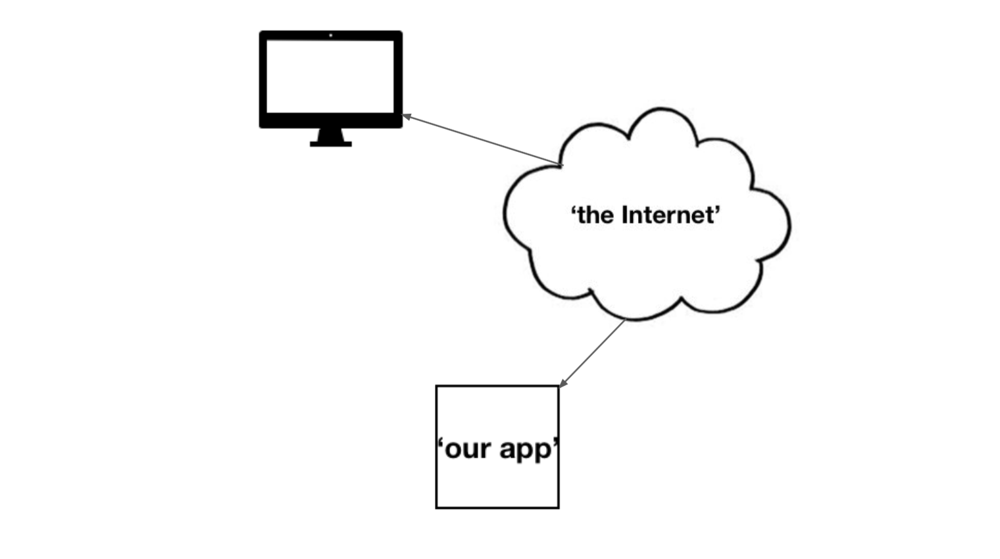
  Previously, we had our app deployed in a VM in OCI.
  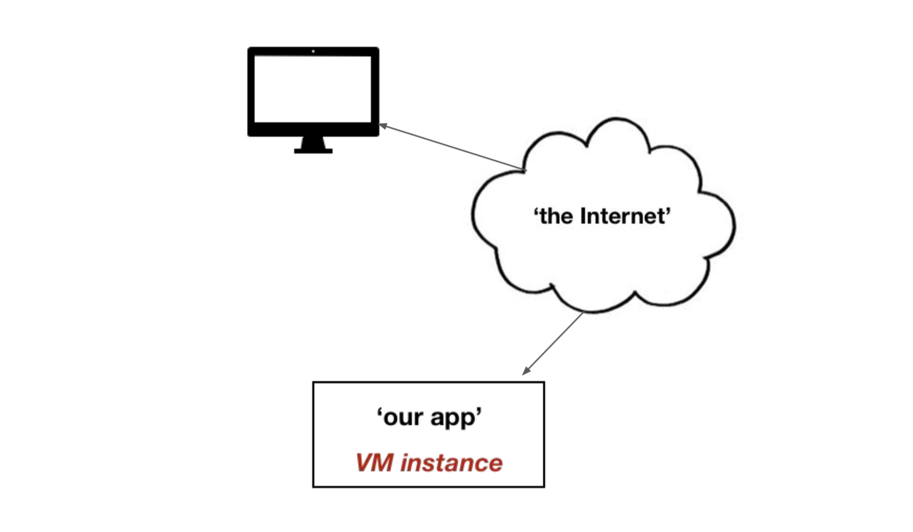
  To make our app more flexible, we’ll containerize it within a deployed VM.
  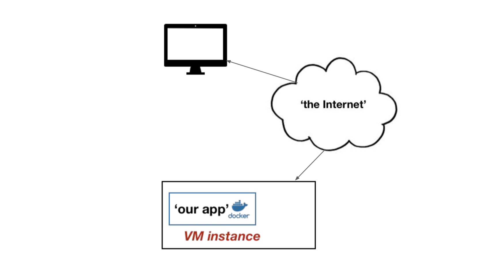

## Containers
The growth of technology into every aspect of our lives and days has created an immense demand on software, the companies and organisations that sell and deliver products based on software, or just use software in their businesses. This really is nearly any business and anyone who doesn’t live entirely off the grid. This pressure has spurred innovation and standardisation. And the needs and stakes are so high, it has fundamentally changed how software is developed and deployed into production.

But this evolution isn’t without precedent. Could you imagine the world economy relying on methods like this for the trade of goods? There would be no way you would get your new iPhone in time. Now, we take for granted that shipping containers efficiently move between different modes of transportation, different shipowners and shipping companies. And they are standardized, ubiquitous and available anywhere in the world. Almost always, no matter what’s in, if it fits, it ships!

Modern software is becoming quite similar. As software systems become more complicated, this complication has driven software to be divided into smaller pieces such as microservices. Whether they are called microservices or not, these smaller pieces of software each need to be packaged, built, deployed and accessed by other pieces of software around them to function as a total system. These small pieces of software can be deployed into containers that allow them to run on the same machine, virtual or real, but making it appear to the software that it is the only process running.

Here is where we depart from the shipping container metaphor for a bit. While a shipping container's sole job is to keep things contained within itself, typically, interesting and useful software depends on other software around it to do its job. Here is where the need for container orchestration is born. There are definite benefits in keeping logically distinct software separate from each other. You can develop, deploy, scale and maintain each small piece without too much fuss between the other parts of the system, when it’s not all on the same module. However, at some point, different parts of the application likely need to communicate with each other to do something interesting. For example, an API may need to communicate with business logic, it needs, in turn to access information in the database. Containers themselves keep logically distinct pieces of software separate, so they can be built, deployed, maintained, managed and scaled on their own, without unduly affecting other parts of the system.

Container orchestration on the other hand defines how these containers interact as a system, the needs between each other and how they come together to your performant, manageable, reliable and scalable system.

It is currently safe to say that Docker is the dominant leader in both technology and an adoption in containers. While others exist in the space, their dominance is so great, when you mention containers, it is almost synonymous with Docker. Other players exist in niche application and some movement around standardisation is occurring, although it is only at the beginning, therefore the Docker file standard is essentially today’s standard. And Docker repository has defined a dominant way of hosting versions of a container between developers and systems that need to use them. An example of a system that uses the Docker repo is Kubernetes itself.

Since container orchestration is a much newer space, only growing since the adoption of containers, the technologies are newer and still evolving. However, Kubernetes is quite advanced, and with AWS finally joining its competitors in embracing Kubernetes, it now has the backing of nearly every major player in cloud computing through the Cloud Native Computing Foundation, also known as the CNCF. CNCF is the organisation that now governs Kubernetes. It is basically an organisation that focuses on defining what the industry standards are when it comes to Kubernetes and mediates the interaction between cloud platforms and Kubernetes itself. It has essentially become the de facto standard, especially now that its competing technology, Docker Swarm (Docker’s solution to container orchestration) has now announced support for Kubernetes style configuration and processing. It is clear that Kubernetes is now the de facto standard, if not the acknowledged standard in the industry in container orchestration.

Containerisation changed how software was developed and packaged; container orchestration is changing how containers are deployed into bigger useful systems.

###What is a container?

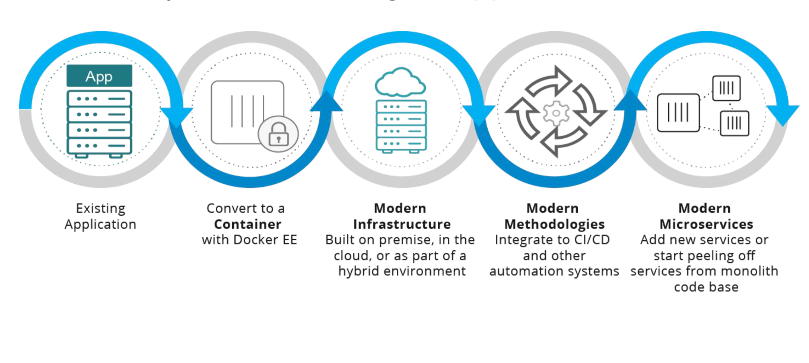
###Difference between containers and VMs

Important distinction:

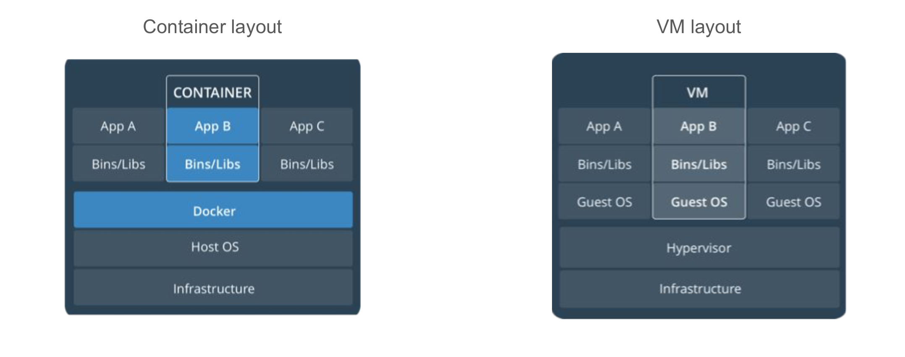
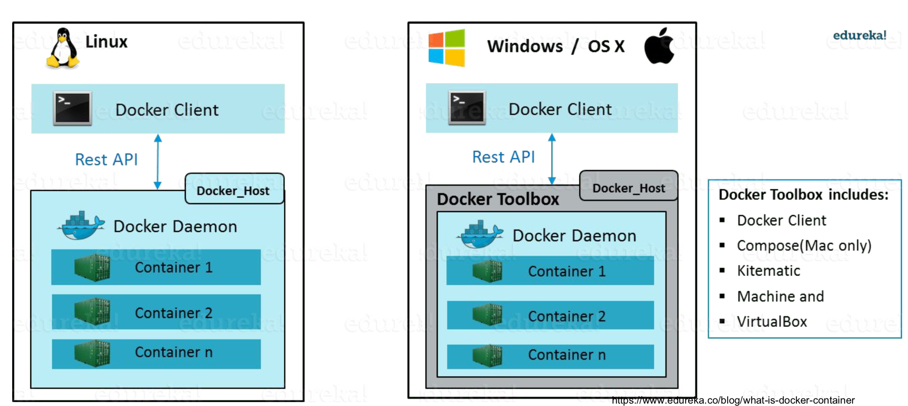
OS = kernel + filesystem/libraries
Image = filesystem/libraries

Containers run on the same kernel, but on different/same images.

In depth analysis: https://www.youtube.com/watch?v=L1ie8negCjc
###Why are we only talking about Docker?

##Docker overview
###The Docker platform

###Docker Engine
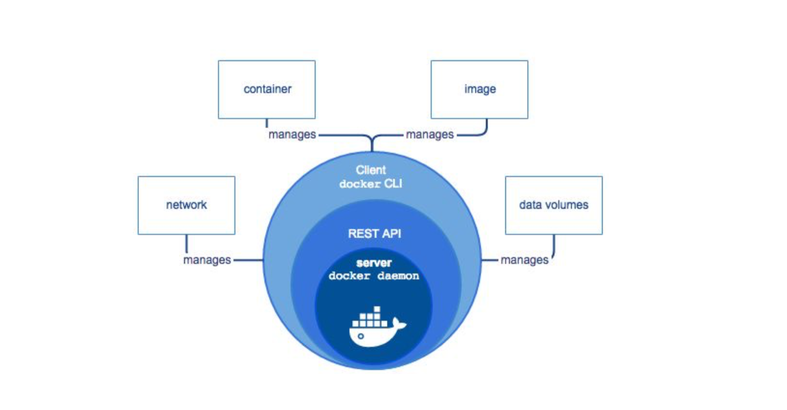
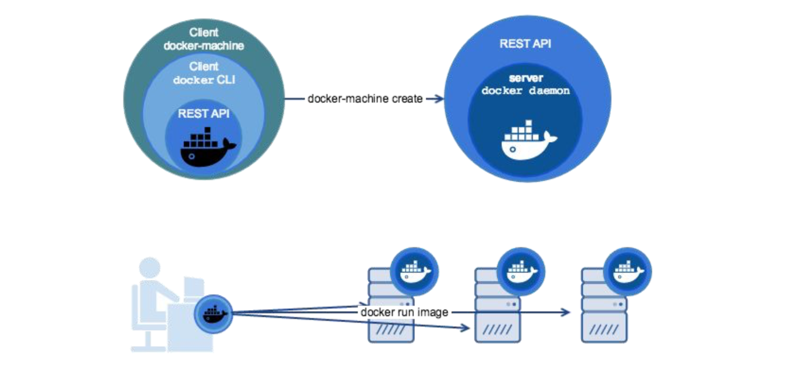
###What can I use Docker for?
###Docker architecture
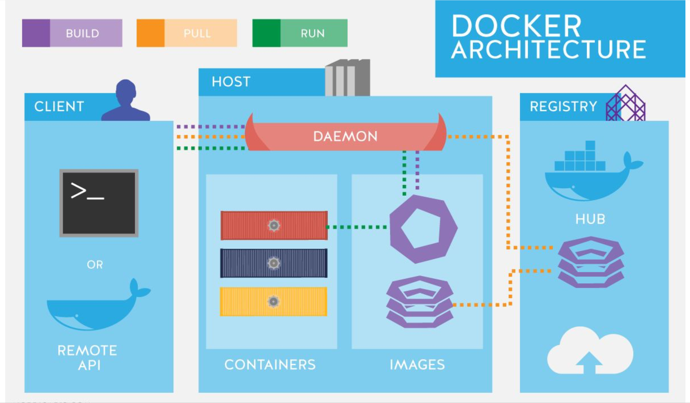

##Develop with Docker
Follow the install instructions for your Operating System:
https://docs.docker.com/install/
Add your user to the docker group (make life easier) Verify version: docker --version
###Prepare Docker environment
####Install Docker
####Verify version
####Verify installation (docker run hello-world)
###Build an image from a Dockerfile

Run hello-world container
```$ docker run hello-world
   Hello from Docker!
   This message shows that your installation appears to be working correctly.
   To generate this message, Docker took the following steps:
   1. The Docker client contacted the Docker daemon.
   2. The Docker daemon pulled the "hello-world" image from the Docker Hub.
   (amd64)
   3. The Docker daemon created a new container from that image which runs the
   executable that produces the output you are currently reading.
   4. The Docker daemon streamed that output to the Docker client, which sent it
   to your terminal.
   To try something more ambitious, you can run an Ubuntu container with: $ docker run -it ubuntu bash
   Share images, automate workflows, and more with a free Docker ID: https://hub.docker.com/
   For more examples and ideas, visit: https://docs.docker.com/get-started/
```
####What is a Dockerfile?
A way to build a new Docker image
Starting from a base image we define a set of instructions to build a new image. Each instructions generates a new docker layer
Simplest docker file:

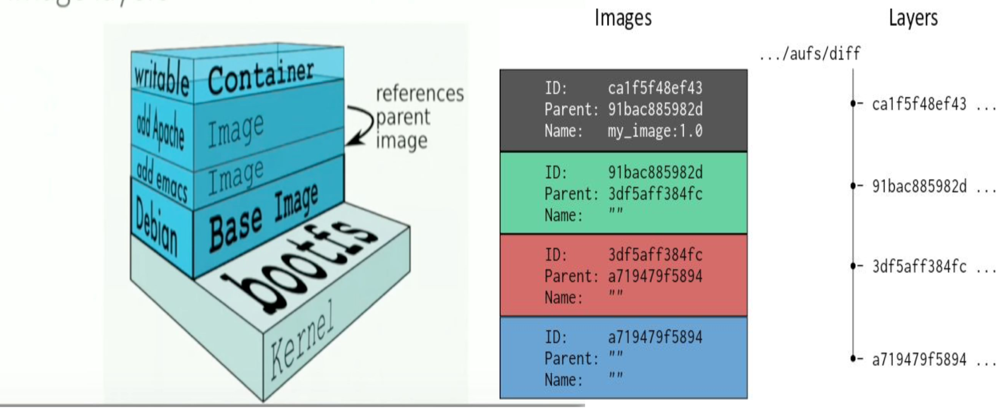

####Start with basic Dockerfile
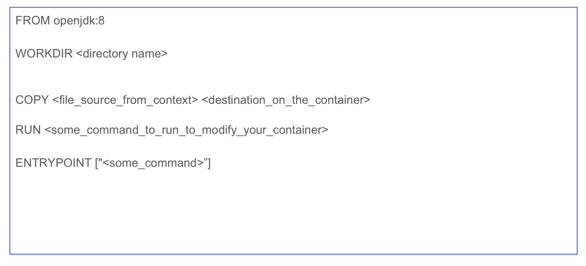
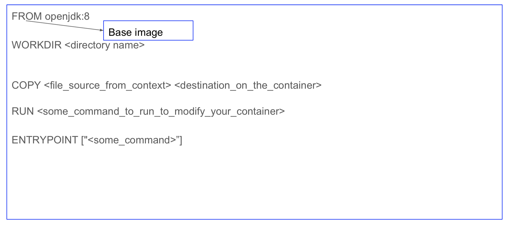
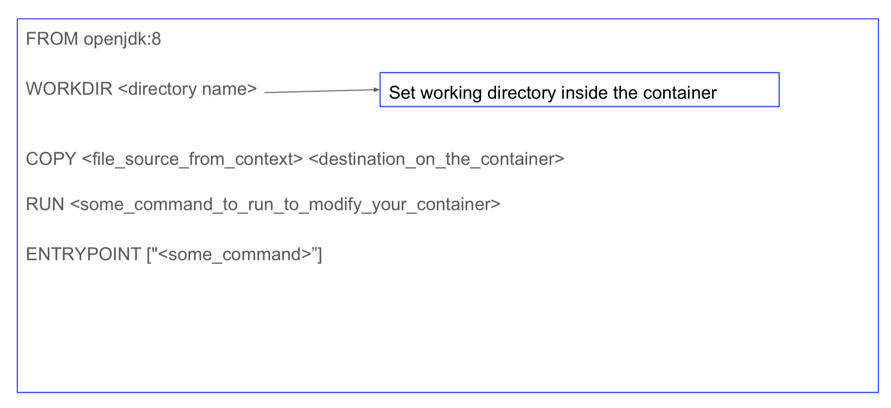
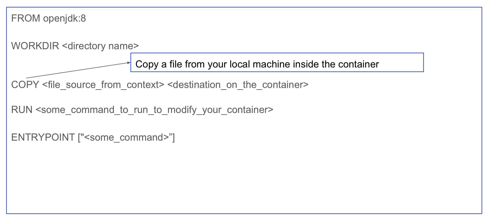
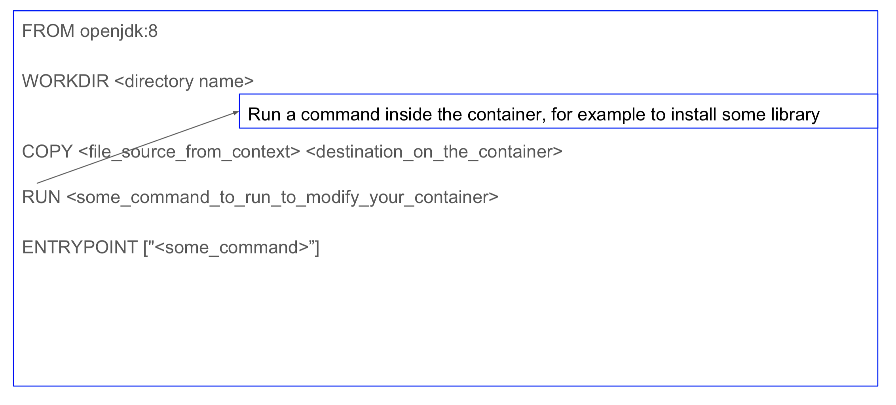
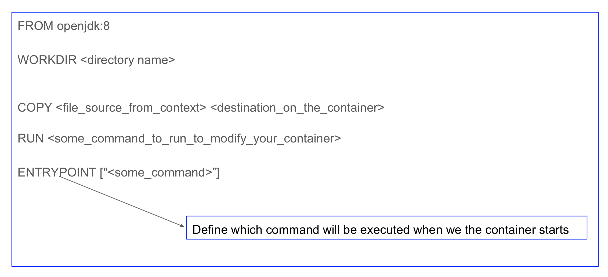
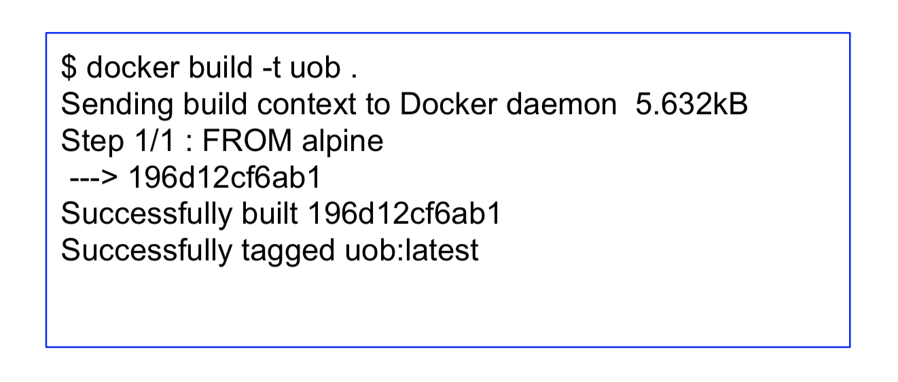

####Build the app
docker build -t <name_of_the-generated_image> <docker_build_context>
####Where is my image?

####Run the app
###Publish the image
####Publish image to Docker
#####Log into Docker (hub.docker.com)
#####Tag image
#####Publish the image
#####Pull and run the image from the remote repo
####Publish image to OCI registry
#####Overview of the OCI registry and user credentails
#####Log in with Docker to OCI registry
#####Tag image
#####Publish the image
#####Pull and run the image from the remote repo
###Interact with a container
####Exec into a container
####Test out container connectivity with the outside world

##Use multi-stage builds
###Why use multi-stage builds?
###Use multi-stage builds
###Cleanup: Name build stages
###Stop at a specific build stage (optional)
###Use an external image as a stage

##Managing application data
###Storage options (volumes, bind mounts and tmpfs)
###Volumes
####Description for volumes, what are they useful for?
####Instances where volumes should be used
####Create a volume and attach to the container
###Bind mounts
####Description for bind mounts, what are they useful for?
####Instances where bind mounts should be used
####Exemplify how a directory on the host machine is mounted into a container
###Tmpfs
####Description for tmpfs mounts, what is it useful for?
####Instances where tmpfs mounts should be used
####Use a tmpfs mount in a container

##Run application in production
###Configure the daemon (dockerrd)
###Configure the containers
###Start containers automatically

